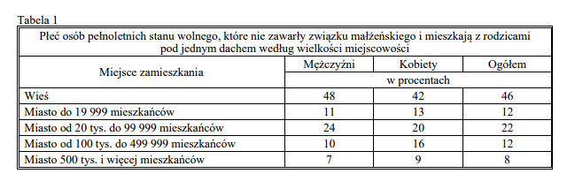
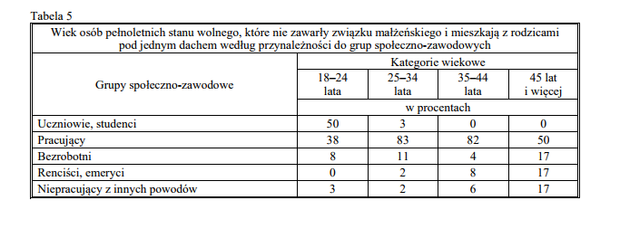
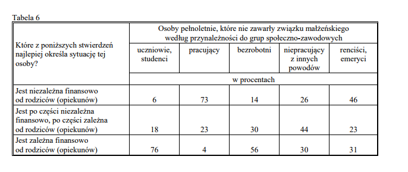

```{r setup, include=FALSE}
knitr::opts_chunk$set(echo = TRUE)
library(ggplot2)
```

> Źródło danych

Jako żródło danych posłużył mi artykuł opracowany przez p.Rafała Boguszewskiego i p.Mariolę Piszczatowską-Oleksiewicz będący podsumowaniem badań CBOSu dotyczących pełnoletnich Polaków stanu wolnego mieszkających z rodzicami (http://www.cbos.pl/SPISKOM.POL/2017/K_098_17.PDF).
W artykule autorzy zawarli przedstawione przeze mnie dane w postaci tabelarycznej.

> Procent Polaków mieszkających z rodzicami w zależności od wielkości rodzinnego miasta

1. Orginalne przedstawienie danych



2. Wizualizacja 

```{r, echo=FALSE,warning=FALSE,message=FALSE,fig.width=9}
city_data<-read.csv("city_type2.csv",header=TRUE,sep=";")


ggplot(city_data,aes(x=Typ,y=Procent,color=Płeć))+
  geom_smooth(se=FALSE,method = "lm",color="black",linetype="dashed")+
  geom_point(size=3.5)+
  geom_smooth(se=FALSE,span=0.4)+
  geom_text(aes(label=Procent),color="black",hjust=2,vjust=1.2)+
  ggtitle("Płeć osób pełnoletnich mieszkających z rodzicami według wielkości miasta")+
  scale_x_continuous(breaks=c(1, 2, 3, 4, 5), 
                       labels=c("Wieś", "Miasto < 20 \n tys.", 
                                "Miasto <20,100) \ntys.", "Miasto <100,500) \ntys.", "Miasto >500 \ntys."))+
  xlab("Wielkość miasta")
 

```

Można zauważyć ogólną tendencję,że im większe jest rodzinne miasto tym mniej młodych dorosłych Polaków mieszka z rodzicami/opiekunami. Największe różnice jeśli chodzi o kobiet i mężczyzn pozostających w rodzinnych domach można zauważyć na wsiach i w miastach zaludnieniu od <100,500) tysięcy mieszkańców. Na wsiach w domach pozostaje więcej mężczyzn w miastach od <100,500) tysięcy mieszkańców więcej kobiet.

> Przynależność do grup społeczno-zawodowych pełnoletnich Polaków mieszkających z rodzicami

1. Orginalne przedstawienie danych



2. Wizualizacja

```{r,echo=FALSE,warning=FALSE}
jobs_data<-read.csv("jobs3.csv",header=TRUE,sep=";")

ggplot(jobs_data,aes(x=factor(Przedzial,levels=c("18-24", "25-34", "35-44", " 45 i więcej")),
                     y=factor(Grupa,levels=c("Studenci/uczniowie","Pracujący","Bezrobotni","Renciści","Bezrobotni z innych powodów"))))+
 geom_tile(aes(fill=Procent))+ 
  scale_fill_gradientn(
                       colours=c("white","orange","darkorange")
                      )+
  geom_text(aes(label = Procent))+
  theme(axis.title.y =element_text() ,plot.title = element_text(hjust =0.5))+
  xlab("Przedział wiekowy")+
  ylab("Grupa społeczna")+
  ggtitle("Przynależność do grup społeczno-zawodowych \n pełnoletnich Polaków mieszkających z rodzicami")
  

```

Najwięcej osób w przedziale wiekowym od 18-24 lat mieszkających z rodzicami  to studenci/uczniowie , 12% mniej stanowią osoby pracujące.Pozostałe grupy społeczne stanowią mniejszość w tej grupie wiekowej. W przedziałach 25-34,35-44 lat z osób mieszkających w rodzinnym domu odpowiednio 83 i 82 procent to osoby pracujące. Wtych przedziałach pozostałe grupy społeczne stanowią wyraźną mniejszość. Wśród najstarszej grupy Plaków mieszkających z rodzicami polowa to osoby pracujące , reszta rozkłada się po równo (17%) między grupy bezrobotnych, renscistów i bezrobotnych z innych powodów.

> Niezależnośc finansowa osób mieszkających z rodzicami w kontekście przynależności do grupy społeczno-zawodowej


1. Orginalne przedstawienie danych



2. Wizualizacja

```{r,echo=FALSE,warning=FALSE,fig.align='center',fig.width=7}
financial_data<-read.csv("financial_independence.csv",header=TRUE,sep=";")

  ggplot(financial_data,aes(x=factor(Typ,levels=c("Całkowicie niezależni","Częściowo niezależni","Całkowicie zależni")),
                            y=Procent,color=Typ))+
  geom_boxplot(aes(fill=Typ),alpha=0.35,width=0.5)+
  geom_point(aes(shape=Praca),size=5,stroke=1.2)+
  geom_text(aes(label=Procent),color="black",hjust=2)+
  xlab("Typ niezależności finasowej")+
  ggtitle("Niezależnośc finansowa osób mieszkających z rodzicami \nw kontekście przynależności do grupy społeczno-zawodowej")
```

Różnice między  przynależnością do grupy społecznej a niezależnością finansową wśród osób mieszkających w rodzinnym domu są znacznie większe zarówno w przypadku pełnej zależności jak i pełniej nezależności finansowej niż częściowej niezależności finansowej. Osoby całkowicie zależne finansowo od rodziców to przede wszystkim studenci i osoby bezrobotne. Osoby niezależne finansowo to przede wszystkim osoby pracujące i renciści.
