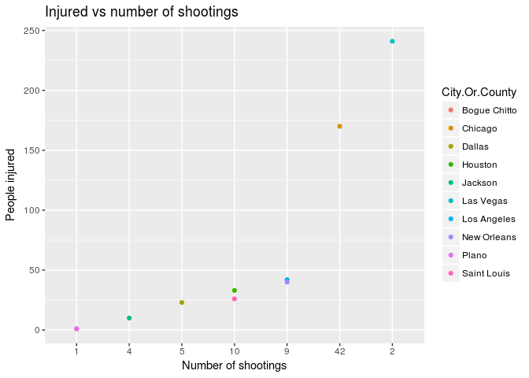
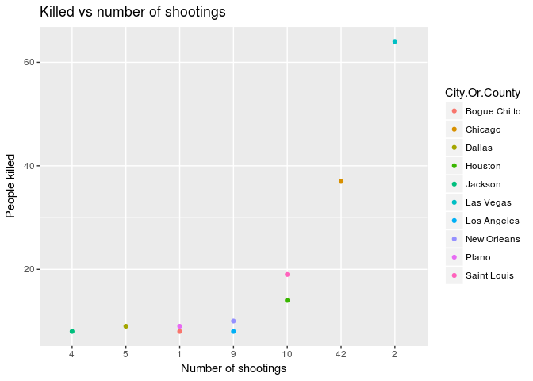
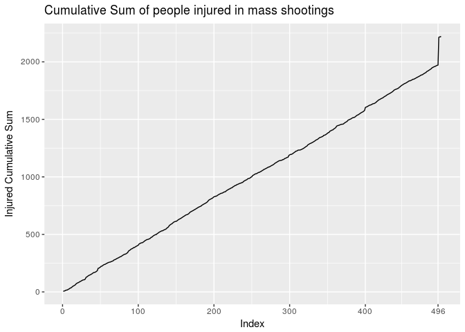
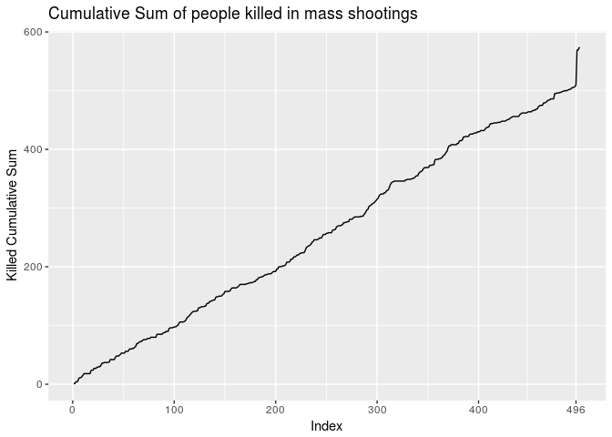

Tydzien 01 - Mass Shootings
================
Wojciech Rosinski
2017-10-07

### Mass Shootings in USA

-   Artykuł oryginalny: <http://flowingdata.com/2017/10/06/in-2017-no-more-than-five-days-without-a-mass-shooting/>
-   Dane: <http://www.gunviolencearchive.org/reports/mass-shooting>

``` r
library(tidyverse)
```

    ## Loading tidyverse: ggplot2
    ## Loading tidyverse: tibble
    ## Loading tidyverse: tidyr
    ## Loading tidyverse: readr
    ## Loading tidyverse: purrr
    ## Loading tidyverse: dplyr

    ## Conflicts with tidy packages ----------------------------------------------

    ## filter(): dplyr, stats
    ## lag():    dplyr, stats

``` r
sh <- read.csv('shootings_years.csv')
to_keep <- names(sh)[1:length(names(sh))-1]
sh <- sh[to_keep]
print(dim(sh))
```

    ## [1] 500   6

``` r
print(head(sh))
```

    ##        Incident.Date     State City.Or.County
    ## 1    October 6, 2017  Illinois        Chicago
    ## 2    October 5, 2017   Arizona    Casa Grande
    ## 3    October 3, 2017   Florida          Miami
    ## 4    October 1, 2017    Nevada      Las Vegas
    ## 5    October 1, 2017    Kansas       Lawrence
    ## 6 September 30, 2017 Tennessee        Memphis
    ##                          Address X..Killed X..Injured
    ## 1     8000 block of S Marshfield         0          5
    ## 2     400 block of W 13th Street         4          0
    ## 3                2051 NW 65th St         0          4
    ## 4          3950 Las Vegas Blvd S        59        241
    ## 5 1000 block of Massachusetts St         3          2
    ## 6       800 block of Kerr Avenue         1          3

``` r
sh <- sh[nrow(sh):1, ]
sh$KilledCumSum <- cumsum(sh$X..Killed)
sh$InjuredCumSum <- cumsum(sh$X..Injured)
```

Zobaczmy, jak ilość rannych oraz zabitych zmienia się w funkcji ilości strzelanin.

``` r
shoot_state <- sh %>% group_by(State) %>% 
    summarise(
        State.Shootings = n(),
        State.Killed = sum(X..Killed),
        State.Injured = sum(X..Injured)) %>%
    arrange(State.Killed) %>%
    top_n(10, State.Killed)

shoot_city <- sh %>% group_by(City.Or.County) %>% 
    summarise(
        City.Shootings = n(),
        City.Killed = sum(X..Killed),
        City.Injured = sum(X..Injured)) %>%
    arrange(City.Killed) %>%
    top_n(10, City.Killed)


gg_city_injured <- ggplot(shoot_city, aes(x = reorder(City.Shootings, City.Injured, sum), 
                                  y = City.Injured, color = City.Or.County)) +
    geom_point() +
    xlab('Number of shootings') +
    ylab('People injured') +
    ggtitle('Injured vs number of shootings')

gg_city_killed <- ggplot(shoot_city, aes(x = reorder(City.Shootings, City.Killed, sum), 
                                  y = City.Killed, color = City.Or.County)) +
    geom_point() +
    xlab('Number of shootings') +
    ylab('People killed') +
    ggtitle('Killed vs number of shootings')
```

``` r
plot(gg_city_injured)
```



``` r
plot(gg_city_killed)
```



Na pierwszym miejscu znajduje się Las Vegas, mimo, że miały miejsce tam tylko dwie strzelaniny, zaś w Chicago, gdzie miały miejsce aż 42, sumarycznie zginęło oraz zostały rannych znacznie mniej osób.

Aby zobrazować, jak znaczącym zdarzeniem była strzelanina w Las Vegas 1 października 2017, zastosowany został wykres cumulative sum. W zestawie danych zapisanych jest 500 zdarzeń, posegregowanych malejąco po dacie. Zdarzenie w Las Vegas jest na 4. miejscu. Do wykresu cumulative sum musimy odwrócić uporządkowanie, aby uzyskać porządek rosnący, wtedy strzelanina z 1 października będzie na 496. pozycji - na wykresie widzimy nagły skok funkcji przy tym argumencie, niewidoczny w odniesieniu do jakiejkolwiek innej strzelaniny, co podkreśla znaczenie tego zdarzenia.

``` r
icm <- ggplot(sh, aes(x = 1:500, y = InjuredCumSum)) +
    geom_line() +
    xlab('Index') +
    ylab('Injured Cumulative Sum') +
    ggtitle('Cumulative Sum of people injured in mass shootings') +
    scale_x_continuous(breaks = c(0, 100, 200, 300, 400, 496))


kcm <- ggplot(sh, aes(x = 1:500, y = KilledCumSum)) +
    geom_line() +
    xlab('Index') +
    ylab('Killed Cumulative Sum') +
    ggtitle('Cumulative Sum of people killed in mass shootings') +
    scale_x_continuous(breaks = c(0, 100, 200, 300, 400, 496))

plot(icm)
```



``` r
plot(kcm)
```


