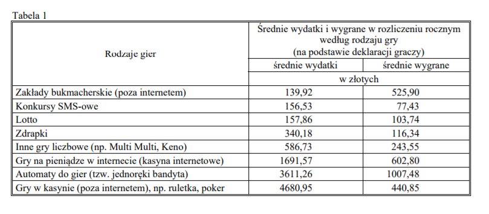

```{r setup, include=FALSE}
knitr::opts_chunk$set(echo = TRUE)
library(ggplot2)
```

### Źródło danych ###

Za źródło danych posłużył mi artykuł będący podsumowaniem badań wykonanych przez CBOS dotyczązych hazardu. http://www.cbos.pl/SPISKOM.POL/2017/K_068_17.PDF .

W artykule znajdują się dane podsumowywujące średnie wydatki i wygrane (w PLN) w rozliczeniu rocznym według rodzaju gry.
Dane te przedstawioe są w postaci tabelarycznej.



### Wizualizacja ### 

```{r,echo=FALSE,warning=FALSE,message=FALSE,fig.width=8,fig.height=7}

hazard_df<-read.csv("hazard.csv")
hazard_df$Rodzaj<-hazard_df$ï..Rodzaj
hazard_df$Zysk<-hazard_df$Wygrane-hazard_df$Wydatki
hazard_df$label<-c("I","F","G","J","D","E","B","C")
hazard_df$Rozmiar_zysku<-abs(hazard_df$Zysk)

ggplot(hazard_df,aes(x=Wydatki,y=Wygrane,size=Rozmiar_zysku,color=Zysk))+
geom_point(aes(shape=Rodzaj,size=0.2))+
geom_jitter()+
geom_text(aes(label=label,vjust=2))+
geom_abline(intercept = 0,slope=1,linetype="dashed")+
theme(aspect.ratio=1)+
ylim(0,5000)+
xlim(0,5000)+
scale_size_continuous(limits=c(0,5000),range=c(3,9))+
scale_shape_manual(values=LETTERS[c(-1,-8)])+
scale_color_gradient2(low="#cc0033",mid="#ffcc33",high="#66ff66",midpoint = -500,limits=c(-4500,4500),breaks=seq(-4500,4500,1500))+
ggtitle("Zyski i straty z gier hazardowych w rozliczeniu rocznym w PLN")+
guides(shape =  guide_legend(override.aes = list(size = 3)))

```

Na wykresie łatwo zauważyć, że gry w których poniesiono straty (te znajdujące się pod wyznaczoną prostą) to niemal wszystkie rozważane rodzaje gier hazardowych. Im większy jest rozmiar punktu tym osiągnięto wyższy zysk lub większą stratę.Odwzorowanie to widać również w odległości punktu od wyznaczonej prostej. Im kolor punktu bliżej zielonego tym osiągnięto większy zysk, im bliej czerwonego tym osiągnięto większą stratę. Można więc łatwo odczytać, że jedyną grą przynoszącą zyski są zakłady bukmacherskie.Największą stratę generują zaś gry w kasynie.