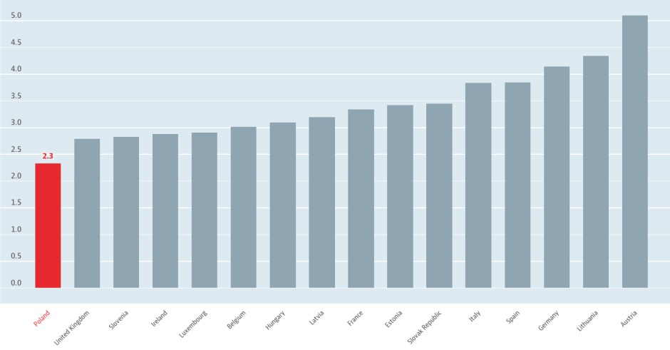

W tym tygodniu będę bazować na artykule 
[Polacy w ogonie Europy. Lekarzy jest mało, rezydenci pokazują skalę problemu](http://tvn24bis.pl/z-kraju,74/protest-glodowy-lekarzy-rezydentow-ile-kosztowalaby-ich-podwyzka,781050.html). 

Można dowiedzieć się z niego, między innymi, że w Polsce na 1000 pacjentów przypada zaledwie 2,3 lekarza. W artykule dane przedstawione zostały na poniższym wykresie:


Rzeczywiście, można odczytać z niego, że Polska ma najgorszy wynik wśród analizowanych krajów Unii Europejskiej. Chciałam jednak zestawić dane dotyczące liczby lekarzy przypadających na 1000 mieszkańców z innymi, pozwalającymi w pewnym stopniu ocenić efektywność ich pracy: *roczna liczba konsultacji lekarskich na mieszkańca* oraz *przeciętne miesięczne wynagrodzenie lekarzy według parytetu siły nabywczej*.

Dane wzięte zostały z publikacji OCD: [Health at a Glance: Europe 2016](
http://www.keepeek.com/Digital-Asset-Management/oecd/social-issues-migration-health/health-at-a-glance-europe-2016_9789264265592-en) 

```{r}
library(ggplot2)
library(ggrepel)
load("lekarze_kraje.rda")
```


```{r, fig.height= 10, fig.width= 15}
ggplot(kraje, aes(x = l_lek, y  = kons_per_os)) +
  geom_point(aes(size = zarobki, fill = zarobki), shape = 21, colour = "black") +
  geom_label_repel(
    data = subset(kraje, kraj !="Polska"),
    aes(label = kraj)
  ) +
  geom_label_repel(
    data = subset(kraje, kraj =="Polska"),
    aes(label = kraj),
    colour = 'red'
  ) +
  scale_size_continuous(
    name = "Przeciętne miesięczne wynagrodzenie według parytetu siły nabywczej", 
    range = c(10,30)
  ) +
  scale_fill_continuous(name = "Przeciętne miesięczne wynagrodzenie według parytetu siły nabywczej")+
  ggtitle("Wynagrodzenia oraz nakład pracy lekarzy w Polsce na tle innych krajów Unii Europejskiej") + 
  theme_bw() +
  theme(legend.position="top", 
        axis.text=element_text(size=15),
        axis.title=element_text(size=16,face="bold"),
        title = element_text(size=18)
  ) +
  xlab("Liczba lekarzy na 1000 mieszkańców") + 
  ylab("Roczna liczba konsultacji lekarskich na mieszkańca") +
  guides(fill=guide_legend(), size = guide_legend()) 

```


Na nowym wykresie nadal widać, że pod względem liczby lekarzy na 1000 mieszkańców Polska zajmuje ostatnie miejsce. 
Dodatkowo można zauważyć, że mimo małej liczby lekarzy, roczna liczba konsultacji na mieszkańca jest większa niż w wielu innych krajach. Co wiecej, w większości z tych krajów, jak na przykład Luksemburgu czy Irlandii, zarobki lekarzy są wyższe niż w Polsce.