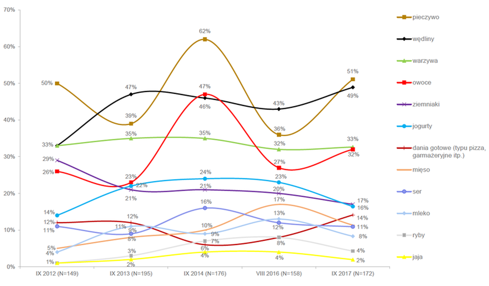

Dane przedstawione w artykule ( https://businessinsider.com.pl/twoje-pieniadze/budzet-domowy/ile-polacy-wyrzucaja-jedzenia-raport-pazdziernik-2017/7285v6k) opisują ilość wyrzucanego jedzenia przez Polaków w ostatnich latach. W szczególności autorzy chcą pokazać wyniki badań Kantar Millward Brown na zlecenie Federacji Polskich Banków Żywności. Mają one na celu przedstawienie skali wyrzucanych produktów w podziale na grupę żywności oraz zaprezentowanie skali zmian tych udziałów r/r. Poniżej przedstawiam wykres zamieszczony w artykule;

```{r setup, include=FALSE}
knitr::opts_chunk$set(echo = TRUE)
```


```{r cars,message=FALSE, cache=FALSE,warning=FALSE}
jedzenie3<-read.csv2("C:\\Users\\Majka\\Documents\\MINI\\techniki\\jedzenie4.csv")
library(ggplot2)
library(ggthemes)

```

```{r echo=FALSE, out.width='70%'}

```
#


Zamiast jednego wykresu liniowego zdecydowałam się na pogrupowanie danych w konkretnych latach i zaznaczenie nad słupkami zmian procentowych względem ostatnio notowanych wielkości. Tak by można oddzielnie patrzeć na dany rok a przy tym sprawdzić zmiany względem poprzedniego.


```{r pressure, cache=FALSE, message=FALSE, out.width='120%'}
ggplot(jedzenie3,aes(x = reorder(rodzaj, -wartosc),y=wartosc,color=spadki,fill=rodzaj,label=scales::percent(spadki)))+
  geom_bar(aes(group=rok),stat="identity",position=position_dodge(),color="black")+
  
  labs(x="produkty",y="Procent",title = "Produkty wyrzucane przez Polaków ostatnich latach",color="zmiany r/r.",size=2)+
 
  facet_wrap(~rok,ncol=2, scales="free_x") +
  geom_text(aes(color=spadki), size=2,nudge_y=0.1)+
  scale_color_manual(values=c("red","grey","#006600"))+
  scale_color_gradient2(midpoint=0,high="#006600",low="red",mid="grey",na.value="transparent")+
  theme_calc()+
theme(axis.text.x = element_text(angle=85, vjust=0.5), panel.border = element_blank())
```


Z wykresu możemy odczytać że najczęściej wyżucane produkty to pieczywo, Wędliny, warzywa i owoce. Oraz że zmiany rok do roku nierzadko są większe niż 50%.  Oraz, że największe wachania odnotowywane były na produktach, które najrzdzej są wyrzucane.

