#Producenci kart graficznych

####Ahmed Abdelkarim - Praca domowa 3

Od lat wśród producentów kart graficznych liczy się tylko Nvidia i AMD -- oznacza to wiele okazji do bezpośredniej konkurencji, niestety częściowo opartej o wprowadzanie konsumentów w błąd -- choć w wielu przypadkach są to jedynie dane wewnętrzne, które wyciekły. Zwłaszcza techniki wizualizacji danych Nvidii stały się pośmiewiskiem internetu: 
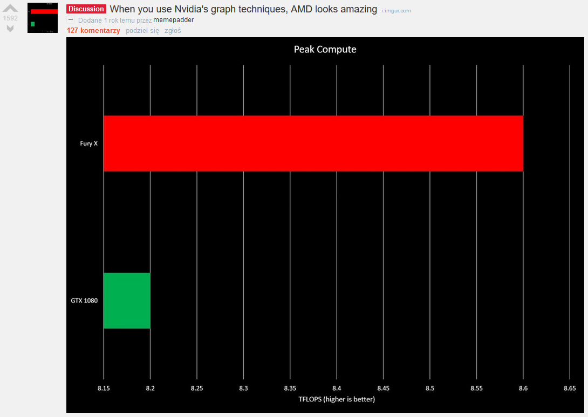
Obie firmy jednak stosują wykresy, które zniekształcają dane.

##Nvidia
Pierwszym przykładem nierzetelnej prezentacji danych są slajdy Nvidii prezentowane później na wielu portalach entuzjastów sprzętu, np. http://www.tomshardware.co.uk/nvidia-geforce-337.50-driver-benchmarks,news-47610.html.
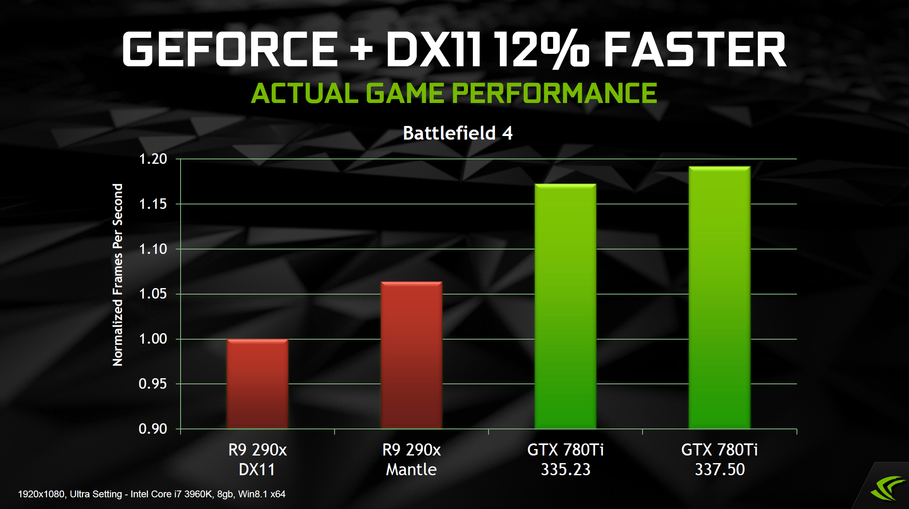

Ze względu na przesunięcie początku osi, słupek przedstawiający kartę Nvidii z nowszymi sterownikami jest 3 razy wyższy, niż słupek karty AMD przy DirectX 11, mimo, że rzeczywista przewaga karty Nvidii to niecałe 20%. Ponadto, opisy słupków również są mylące -- przy karcie AMD dolny napis oznacza użytą bibliotekę, a przy karcie Nvidii wersję sterownika. Wersja sterowników AMD nie została uwzględniona.

Kolejny przykład złej prezentacji danych pochodzi z materiałów dostępnych na stronie Nvidii: https://international.download.nvidia.com/geforce-com/international/pdfs/GeForce-GTX-750-Ti-Whitepaper.pdf
Co ciekawe, został osiągnięty efekt odwrotny do zamierzonego:
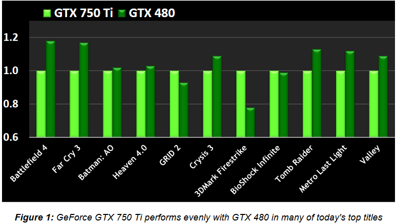

Wykres prezentuje porównanie wydajności dwóch kart Nvidii -- GTX 480, dawnego flagowego produktu, oraz GTX 750 Ti, która była znacznie tańszą, budżetową kartą. Podpis pod wykresem sugeruje, że wydajność nowszej budżetowej karty jest podobna, jednak ze względu na przesunięcie osi, różnice wydają się znacznie większe niż w rzeczywistości (na jej niekorzyść). Jedyne porównanie, w którym nowsza karta wygrywa, to syntetyczny benchmark.

Następny wykres pochodzi ze slajdów wewnętrznych Nvidii stworzonych przez Mercury Research, które wyciekły i zostały opublikowane na wielu stronach, np. https://www.forbes.com/sites/jasonevangelho/2015/08/19/nvidia-increases-desktop-gpu-market-share-again-despite-multiple-amd-radeon-releases/#59c622bf7cf8.
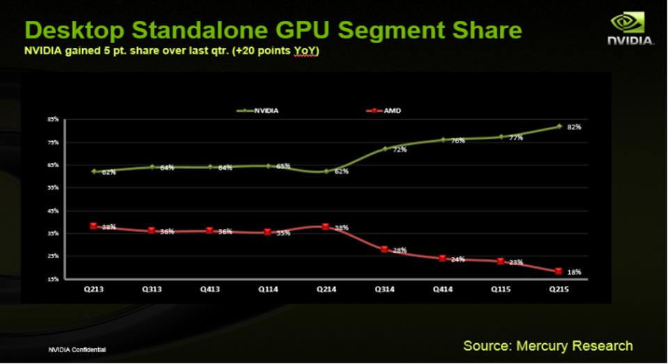

Przedstawia udział Nvidii i AMD na rynku komputerów stacjonarnych, bez kart zintegrowanych. Pionowa oś ograniczona jest między wartościami 15-85%, zamiast 0-100%, przez co spadek AMD wydaje się znacznie bardziej drastyczny -- aż do dna, podczas gdy wzrost Nvidii jest bardziej zaakcentowany. Ponadto ze względu na oczywisty duopol na rynku kart graficznych, dane sumują się do 100%, więc lepszym sposobem reprezentacji danych byłoby narysowanie jednej linii, oddzielającej AMD od Nvidii, i zakolorowanie obszarów na odpowiednie kolory.

Ostatnim wykresem Nvidii, który opracowałem, jest wykres dotyczący ostatniej generacji kart graficznych, porównujący dwie budżetowe karty (obecnie AMD RX 480 nie jest budżetowa, ze względu na ceny mocno zawyżone przez kopaczy kryptowalut). Został opublikowany przez stronę videocardz (https://videocardz.com/61753/nvidia-geforce-gtx-1060-specifications-leaked-faster-than-rx-480) razem z wyciekiem specyfikacji karty.
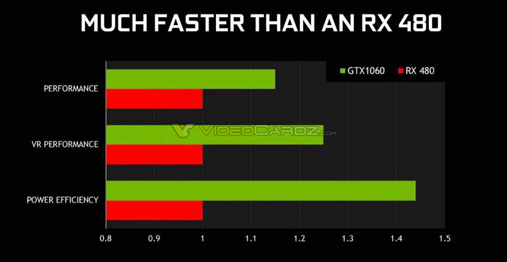

Jest to kolejny wykres z przesuniętym początkiem osi, przez co karta Nvidii wydaje się znacznie bardziej wydajna i efektywna. Ponadto, kolumny są opisane jedynie ogólnymi sformułowaniami takimi, jak "performance", mimo że stosunkowa wydajność kart znacząco zależy od konkretnej aplikacji, która z nich korzysta. Opis "MUCH FASTER THAN AN RX 480" jest nietrafny, szczególnie, że początkowa różnica w cenie tych kart była bardzo zbliżona do rzeczywistej różnicy wydajności, którą przedstawia ten wykres (pomijając metodologię "badania").

##AMD
AMD nie pozostało dłużne Nvidii -- slajd przedstawiający wzrost wydajności karty RX 480 od premiery, dostępny np. pod adresem http://wccftech.com/amd-radeon-software-crimson-relive-driver-leak/, pokazuje, że nie tylko Nvidia oszukuje:
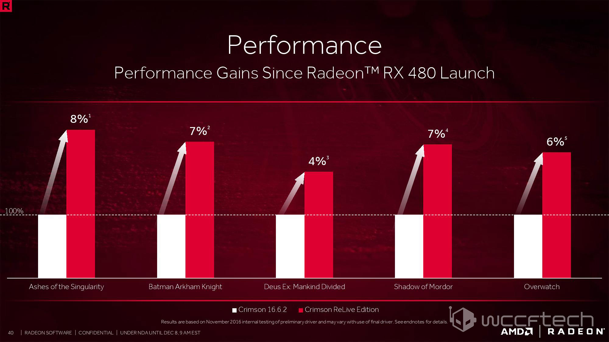

Oś została przesunięta, a w dodatku początek osi nie został oznaczony! Oznaczona została wartość 100%, co na podstawie danych sugeruje początek wykresu w punkcie 94% -- w ten sposób słupki pokazują imponujący wzrost wydajności w wielu grach, mimo, że faktyczne wartości są rzędu 5% (co jak na sterowniki jest dużym wzrostem, ale nie tak, jak sugerowałaby grafika).

Podobnie jak Nvidia, AMD również pokazało źle zaprezentowany wykres na swoją niekorzyść (slajdy AMD, dostępne np. na stronie https://www.pcworld.com/article/3147292/software-games/feature-stuffed-radeon-software-crimson-relive-debuts-amds-rivals-to-shadowplay-fraps.html):
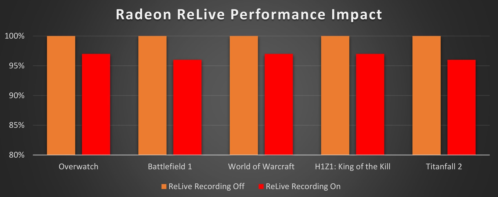

Nieuważne przesunięcie początku osi sprawia, że różnica wydajności na poziomie 3-4% wydaje się duża.

Ostatnią "perełką" AMD jest wielka infografika dotycząca porównania technologii adaptywnej synchronizacji AMD FreeSync z Nvidia G-Sync, dostępną bezpośrednio na stronie AMD (https://www.amd.com/PublishingImages/graphics/illustrations/968px/amd-freesync-technologies-infographic-869.jpg):
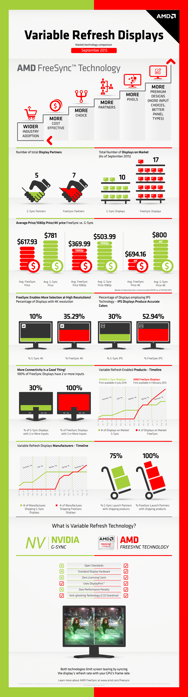

Warto zwrócić uwagę na poszczególne elementy, na przykład porównanie liczby partnerów:

Nie ma żadnych osi, a kształt wykresu sprawia, że wzrost AMD wydaje się większy -- bardziej wzrosło pole, a ponadto miejsce, w którym jest wzrost, prawie nie jest zasłonięte.

Porównanie cen wydaje się uczciwe...
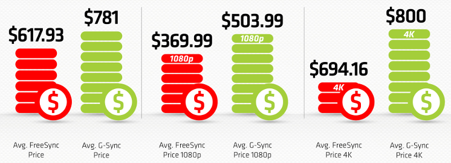

...dopóki nie przyjrzymy się dokładniej. Porównanie środkowe rzeczywiście jest uczciwe, ale porównanie po lewej wykorzystuje zaokrąglenia (6 pasków dla AMD, 8 dla Nvidii -- jeden pasek odpowiada około \$100, a różnica to \$160). Z kolei porównanie po prawej, w przeciwieństwie do dwóch pozostałych, pokazuje znaczne przesunięcie punktu początkowego, przez co najmniejsza ze wszystkich trzech różnic wydaje się największą.

Również porównanie wyboru monitorów wprowadza w błąd:
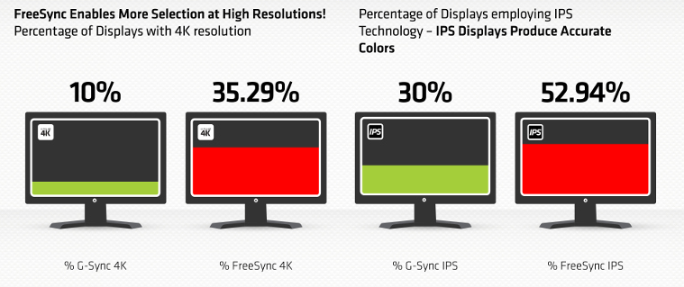

Sposób prezentacji sugeruje, że w pełni zapełniony monitor oznacza 100%, jednak na pierwszym porównaniu 35.29% zapełnia 2/3 monitora. Ponadto, oba z nich zostały odrobinę nieprawidłowo przeskalowane (z korzyścią dla AMD) -- na wykresie po lewej mamy stosunek 52 do 14 pikseli wysokości (3.714), a z danych wynika stosunek 3.529. Na prawym wykresie jest stosunek 56 do 31 pikseli (1.806), wobec stosunku 1.765 wynikającego z danych. 

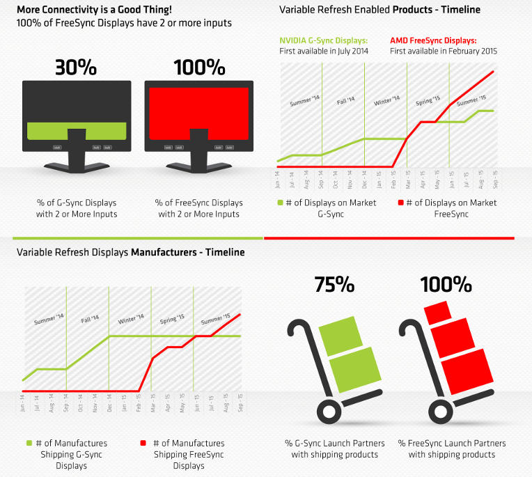
Na następnym wykresie z monitorami jest uwzględniona podstawka, która zasłania większą część wykresu Nvidii niż AMD. Tutaj pełen monitor oznacza 100% -- więc wstępne założenie nie było zupełnie złe.
Kolejne dwa wykresy nie uwzględniają osi pionowej, mimo, że mierzona rzecz to konkretna liczba (modeli monitorów i producentów). 
Spośród tych wszystkich wykresów, najbardziej należy jednak zwrócić uwagę na ostatni -- dane zostały zaprezentowane w zupełnie nieporównywalny sposób: słupki zostały obrócone, a w dodatku każdy z nich jest innego rozmiaru. Ponadto, najbardziej narzucające się sposoby interpretacji zupełnie nie odpowiadają danym. Liczba prostokątów sugeruje wartość większą o połowe, co nie jest zgodne z prawdą. Po obróceniu, prostokąty mają odpowiednio wymiary 64 x 51, 54 x 46 i 35 x 27, co daje stosunek sum pól 5748/6693 równy 0.859, a nie 0.75. 
Prawdopodobnie relacją przyjętą przez osobę tworzącą grafikę jest wysokość lub szerokość pudełek: sumowanie wysokości prostokątów daje stosunek 97/124, co daje 0.782, a sumowanie szerokości daje stosunek 118/153, czyli 0.771 (wciąż niepoprawne rezultaty, ale zbliżone do oczekiwanych).

##Bonus -- chipy Apple
Zbliżonym tematem są chipy będące sercem iPadów -- A5X i A6X. Grafika przedstawiona na prezentacji nie wymaga dodatkowego komentarza...
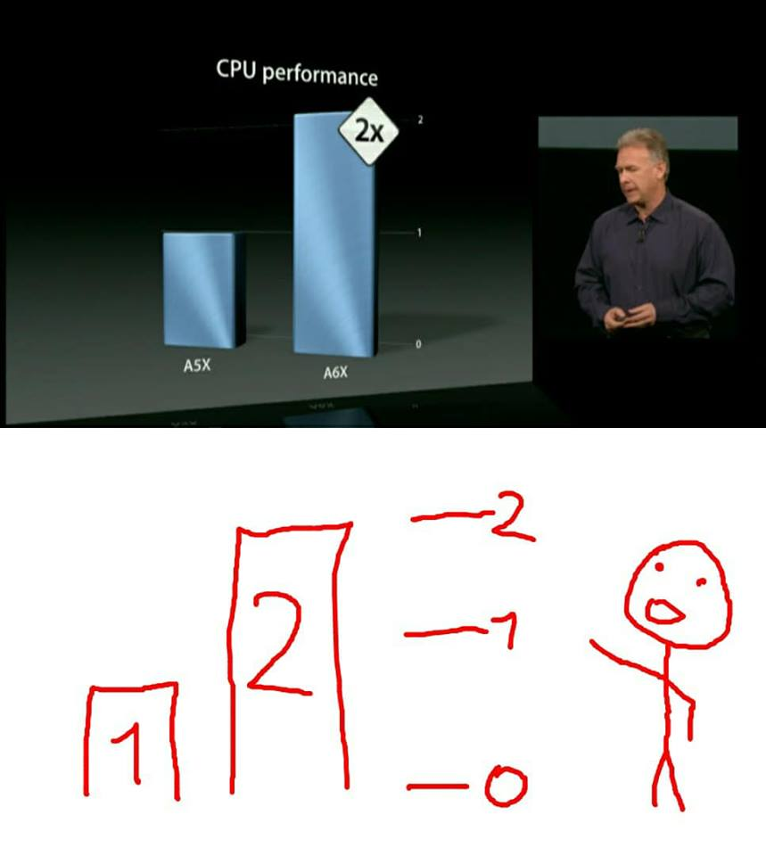