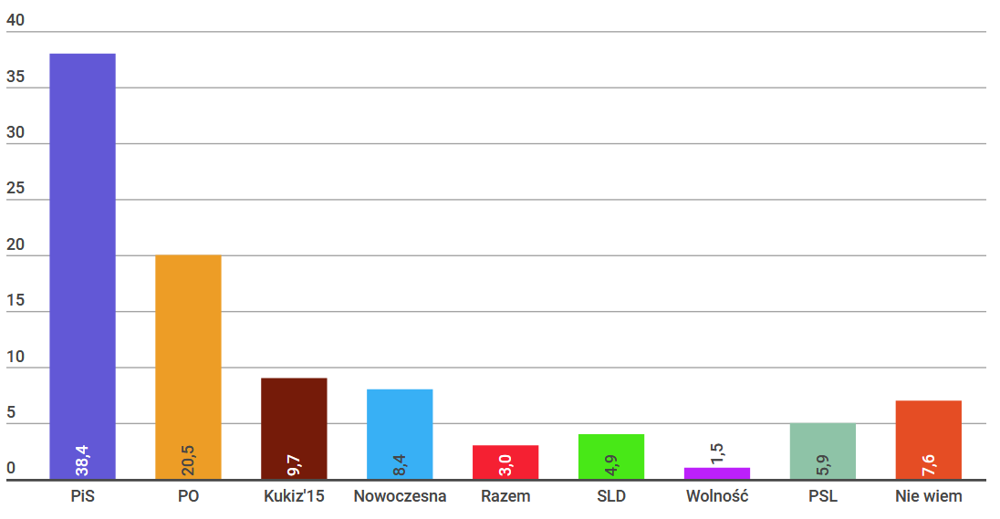
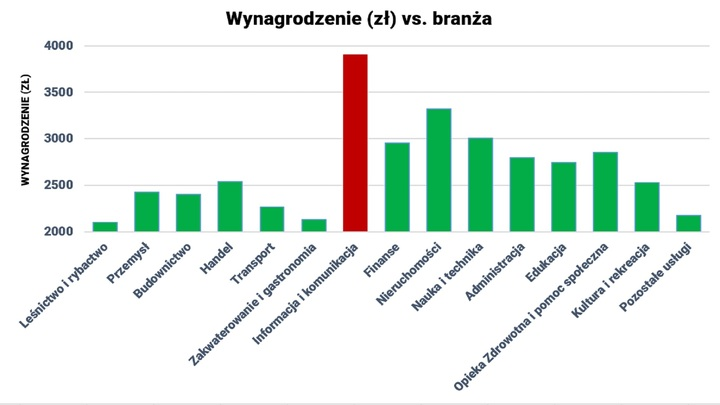
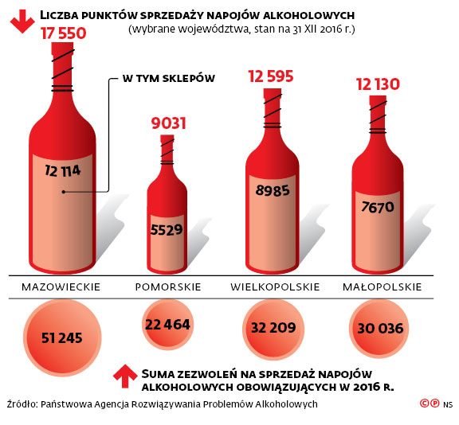

W tym tygodniu trafiłam na 3 grafiki, które mogą budzić wątpliwości co do rzetelnego przedstawienia danych. Postanowiłam umieścić wszystkie, gdyż każda z nich w nieco inny sposób przekłamuje dane.

# 1. Płynne poparcie

[Pierwszy artykuł](https://www.onet.pl/?utm_source=wiadomosci_viasg&utm_medium=nitro&utm_campaign=allonet_nitro_new&srcc=ucs&pid=955b8b06-50a9-4838-b99f-71985658e0a6&sid=b177a2c9-166f-4113-9b28-185bbe554807&utm_v=2) pochodzi ze strony onet.pl i przedstawia poparcie poszczególnych partii politycznych.

Słupki mogłyby być ustawione malejąco, jednak większym problemem na tym wykresie jest to, że wysokości słupków nie odpowiadają wysokości poparcia. Poparcie PO wynosi `20.5`, jednak słupek ma wysokość `20`. Podobna sytuacja ma miejsce w przypadku PSL. 

Na wykresie rysowane są słupki o wysokości równej części całkowitej poparcia. Prawdopodobnie jest to usterka techniczna, jednak w przpadku partii o mniejszym poparciu różnica wysokości równa `0.9` może mieć znaczenie. Przykładem jest partia SLD, której wartość poparcia wynosi` 4.9`, podczas gdy słupek ma wysokość `4`. Różnica jest równa `0.9`, zatem przedstawiona na wykresie wartość poparcia jest mniejsza od rzeczywistej o około `18%`.

# 2. Minimane zarobki
Drugi wykres pochodzi z [artykułu](https://praca.money.pl/wiadomosci/artykul/informatycy-praca-wynagrodzenia-kodilla,188,0,2379452.html) dotyczego zarobków programistów. 

W tym przypadku problemem jest wartość, w której zaczepione zostały słupki. Punkt 0 znajduje się poza wykresem, przez co różnice w wysokościach zarobków zostały uwypuklone.
W branży informacja i komunikacja zarabia się niecałe `4000`, w leśnictwie i rybactwie nieco ponad `2000`, czyli około 2 razy mniej. Na wykresie natomiast różnica w zarobkach wydaje się dużo większa.

# 3. Czy te butelki mogą kłamać?

Trzecia grafika, którą znalazłam pochodzi z artykułu: [Alkohol zniknie z okien wystawowych sklepów](http://biznes.interia.pl/wiadomosci/news/alkohol-zniknie-z-okien-wystawowych-sklepow,2541430,4199). 

W lipcu tego roku Naczelny Sąd Administracyjny stwierdził, że eksponowanie w witrynie sklepowej znaków towarowych napojów alkoholowych stanowi niedozwoloną reklamę tych produktów.

Na pierwszy rzut oka wydaje się, że butelki reprezentują liczbę punktów sprzedaży napojów alkoholowych w wybranych województwach. Jednak liczby wynikające z danych nie odpowiadają ani wysokościom, ani polom butelek. 
Stosunek wysokości pierwszej butelki do drugiej to `1.66`, stosunek ich pól to `2.88`, a według podanych danych powinien wynosić: `1.94`.
Za wysokość butelki przyjęłam odległość pomiędzy najniższym a najwyższym punktem obszaru.

Dodatkowo, etykietki na butelkach powinny przedstawiać liczbę sklepów, w których sprzedaje się alkohol.
Stosunek wysokości pierwszej etykietki do drugiej to `2.03`, stosunek ich pól to `3.92`, a według podanych danych powinien wynosić: `2.2`.
Wysokość etykietki liczyłam od najniższego do najwyższego punktu obszaru.

Co więcej, różne wielkości etykiet na butelkach sugerują, że być może stosunek wysokości lub pól etykietek i butelek odpowiada liczbom z danych. Jednak znów stosunki te nie pokrywają się z danymi.
Stosunek wysokości pierwszej butelki do jej etykietki wynosi: `1.87`, stosunek ich pól to: `1.79`. Z danych wynika, że powinien być równy:`1.45`.