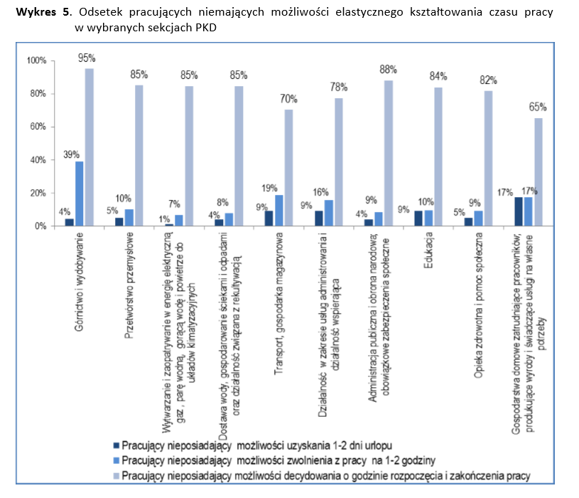

---
output:
  html_document: default
  pdf_document: default
---

```{r setup, include=FALSE, warning=FALSE, message=FALSE, echo=FALSE, results='hide'}
```

##[Techniki Wizualizacji Danych] Praca domowa 3
####Mateusz Mechelewski 262760

Jako przykład błędnie wykonanego wykresu wybrana została jedna z grafik zamieszczonych w _Badaniu organizacji i rozkładu czasu pracy w Polsce w 2015 roku_ przez Główny Urząd Statystyczny. Wykres przedstawiony został poniżej i jest dostępny na 19. stronie opracowania dostępnego w [portalu informacyjnym](http://stat.gov.pl/obszary-tematyczne/rynek-pracy/opracowania/badanie-organizacji-i-rozkladu-czasu-pracy-w-polsce-w-2015-r-,12,1.html) Głównego Urzędu Statystycznego. 

<br />

<center>

</center>

Wykres miał na celu pokazanie podziału zawodów (według kodów PDK) ze względu na elastyczność wyboru godzin pracy - według trzech kategorii:

a) możliwość uzyskania 1-2 dni urlopu

b) możliwość uzyskania zwolnienia z pracy na 1-2 godziny

c) możliwość decydowania o godzinie rozpocęcia i zakończenia pracy.

Podczas projektowania wykresu popełnione zostały następujące błędy:

1. Wykres nie spełnia swojej podstawowej roli ze względu na bardzo małą czytelność, spowodowaną długimi etykietami kategorii zawodów (oś X). Uzyskanie porównania dla poszczególnych kodów PKD jest dodatkowo bardzo utrudnione przez obrót tych etykiet o 90 stopni. 

2. Kolejnym błędem jest brak posortowania zawodów względem sumarycznie pojętej elastyczności czasu pracy. Powoduje to konieczność samodzielnej analizy uzyskanych wyników i ich sortowania.

3. Dane dla każdego zawodu nie sumują się do 100%. Wynika to oczywiście z podziału na trzy nierozłączne kategorie - osoby mogące uzyskać 1-2 dni urlopu, bardzo prawdopodobnie będą mogły uzyskać również zwolenienie z pracy na 1-2 godziny. Nie jest to jednak oczywiste przy pierwszej analizie wykresu.

4. Dodatkowym utrudnieniem podczas analizy jest możliwość błędnej interpretacji wykresu na "pierwszy rzut oka" - wykres przedstawia odsetek osób <u>nieposiadających</u> elastycznych godzin pracy, podczas gdy opis zamieszczony pod wykresem odwołuje się do zawodów o najwyższej elastyczności we wszystkich trzech aspektach organizacji czasu pracy (nieprzedstawionych na wykresie).