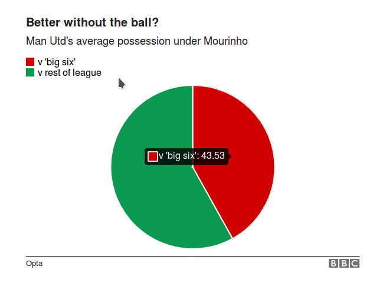
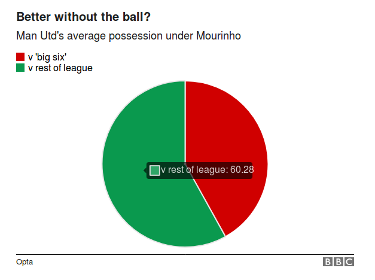

### Posiadanie piłki przez Manchester United pod okiem Mourinho

Wykres kołowy przedstawia procent posiadania piłki przez Manchester United w rozgrywkach Premier League.
Porównane są dwie grupy: 'big six' - najlepsze zespołom ligi angielskiej: Arsenal, Chelsea, Liverpool, Manchester City, Tottenham oraz reszta.

Pierwszym problemem jest przedstawienie danych w postaci wykresu kołowego, co znacznie utrudnia porównanie rzeczywistych wartości ze względu na trudności w porównywaniu pól.

Co więcej, wartości są ze sobą zupełnie nie powiązane, jedna jest kompletnie niezależna od drugiej, a ujęcie ich w wykres kołowy naturalnie przywołuje skojarzenia bezpośredniego powiązania między obiema wartościami.

Kolejnym problemem jest fakt, że po zsumowaniu osiągamy powyżej 100%, podczas rozgrywek z 'big six' posiadanie piłki wynosi 43.5%, zaś podczas rozgrywek z resztą 60.28%.


```{r echo=FALSE, out.width='100%'}

```

```{r echo=FALSE, out.width='100%'}

```