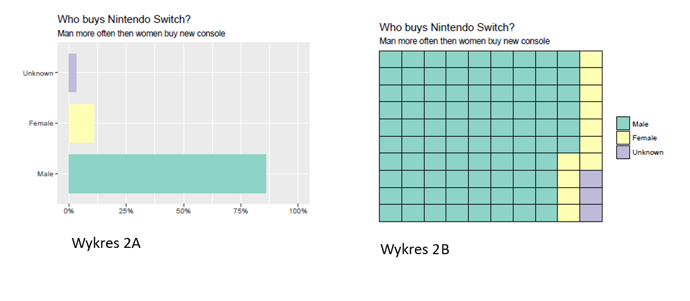

```{r setup, include=FALSE}
library(ggplot2)
library(scales)
library(dplyr)
library(knitr)
library(kableExtra)
knitr::opts_chunk$set(fig.pos = 'H')

Sys.setlocale("LC_CTYPE", "pl_PL.UTF-8")

data <- data.frame(sex=c("Male", "Female", "Unknown"), num=c(0.86, 0.11, 0.03))

data <- data[order(data$num, decreasing = TRUE),]
data[,1] <- factor(data[,1], levels = data[,1])
data
```

# I. Opis zadania

Sposób przedstawienia może w znacznej mierze wpłynąć na jego odbiorcę. Odpowiednie (lub niewłaściwe) przedstawienie danych może ułatwić czytelnikowi znalezienie potrzebnej informacji lub ukryć ważne wnioski płynące z danych. W celu sprawdzenia wpływu formy graficznej wykresu na umiejętność odbiorcy do odczytania danych przeprowadzo poniższe badanie.

Dla danych obrazujących procentowy podział względem płci kupujących konsilę NintendoSwitch  zaproponowano dwa równoważne sposoby wizualizacji (wykres A i B). Następnie poproszono 23 osoby o udzielenie odpowiedzi na pytania  pozwalające ocenić łatwość odczytania prezentowanych danych oraz ich subiektywną ocenę obu wykresów. Źródło danych:  https://www.nintendo.co.jp/ir/pdf/2017/171031_2e.pdf


```{r first_chart, echo = FALSE, fig.height=3.5, fig.width=5, fig.align="center",eval=FALSE}

g1 <- ggplot(data, aes(x=sex, y=num, fill=sex)) +
  geom_col(width=0.75) +
  scale_y_continuous(labels = percent, breaks=NULL, limits = c(0,1)) +
  ggtitle("Who buys Nintendo Switch?", subtitle = "Man more often then women buy new console") +
  guides(NULL) + 
  labs(x=NULL, y = "Percentage") +
  coord_flip()+
  scale_fill_brewer(palette = "Set3",guide=FALSE)
  #scale_fill_manual(values = c("#9ecae1", "#fa9fb5", "#bdbdbd"), guide=FALSE)
g1
```

```{r second_chart, echo = FALSE, dependson=data, fig.height=3.5, fig.width=5, fig.align="center",eval=FALSE}
nrows <- 10
df <- expand.grid(y = 1:nrows, x = 1:nrows)

df$category <- factor(rep(data$sex, data$num*100))  

ggplot(df, aes(x = x, y = y, fill = category)) + 
        geom_tile(color = "transparent", size = 0) +
        scale_x_continuous(expand = c(0, 0)) +
        scale_y_continuous(expand = c(0, 0), trans = 'reverse') +
        theme(
             axis.text = element_blank(),
             axis.title = element_blank(),
             axis.ticks = element_blank(),
             legend.title = element_blank(),
             legend.position = "right") +
        scale_fill_brewer(palette = "Set3")+
        labs(title="Who buys Nintendo Switch?", subtitle="Man more often then women buy new console")
```


```{r second_chart_full, echo = FALSE, dependson=data, fig.height=2.6, fig.width=4, fig.align="center",eval=FALSE}
nrows <- 10
df <- expand.grid(y = 1:nrows, x = 1:nrows)

df$category <- factor(rep(data$sex, data$num*100))  

g2<-ggplot(df, aes(x = x, y = y, fill = category)) + 
        geom_tile(color = "black", size = 0.5) +
        scale_x_continuous(expand = c(0, 0)) +
        scale_y_continuous(expand = c(0, 0), trans = 'reverse') +
        theme(
             axis.text = element_blank(),
             axis.title = element_blank(),
             axis.ticks = element_blank(),
             legend.title = element_blank(),
             legend.position = "right") +
        scale_fill_brewer(palette = "Set3")+
        labs(title="Who buys Nintendo Switch?", subtitle="Man more often then women buy new console") 

g2
```

# II. Proces ankietyzacji 

Każdego z ankietowanych poproszono by w 4 przypadkach oszacował co do procenta udział mężczyzn wśród kupujących konsolę Nintendo Switch. Połowie ankietowanych najpierw pokazywano wykres A, następnie wykres B. Drugiej połowie prezentowano wykresy w odwrotnej kolejności.

1. W pierwszym kroku przedstawiono wykresy nie zawierające skali (wykres A) lub podziału na prostokąty (wykres B)


2. Następnie wykresy wzbogacono odpowiednio o skalę i podział na prostokąty. Ankietowanych poproszono o ponowną ocenę.




\pagebreak

3. Ostatnią częścią ankiety była subiektywna ocena wykresów. Ankietowani zostali poproszeni o wskazanie wykresu, który ich zdaniem lepiej przedstawia zaprezentowane dane. Kryterium oceny nie zostało narzucone w trakcie ankietyzacji.  


# III. Analiza wyników

```{r, echo=FALSE,fig.height=4, echo=FALSE, warning=FALSE}
results <- read.csv("results.csv", header=TRUE)
results <- results[,-1] # drop "name"


summarized_results<-data.frame(percent=as.numeric(names(table(results$X1a))),npeople=table(results$X1a),type="1A")
summarized_results<-rbind(summarized_results,data.frame(percent=as.numeric(names(table(results$X1b))),npeople=table(results$X1b),type="1B"))
summarized_results<-rbind(summarized_results,data.frame(percent=as.numeric(names(table(results$X2a))),npeople=table(results$X2a),type="2A"))
summarized_results<-rbind(summarized_results,data.frame(percent=as.numeric(names(table(results$X2b))),npeople=table(results$X2b),type="2B"))
summarized_results<-summarized_results[,-2]

ggplot(data=summarized_results,aes(y=percent,x=type,fill=type))+
  geom_boxplot(alpha=0.45)+
  geom_jitter(width=0.2,aes(color=type))+
  scale_fill_brewer(palette = "Set1", name="Wykres")+
  scale_color_brewer(palette = "Set1")+
  geom_hline(yintercept=86,linetype=2)+
  labs(x="Wykres", y="Odczytana wartość", title="Wartości odczytane przez ankietowanych",subtitule="Skala znacząco wplywa na poprawę wyniku") + guides(color=FALSE)

```


```{r , echo=FALSE,fig.width=4,fig.height=4, fig.align='center', warning=FALSE}

preferred_sums <- results %>% group_by(Preffered) %>% count()
preferred_sums$proc <- preferred_sums$n / sum(preferred_sums$n) * 100
preferred_sums$Preffered <- c("Słupkowy", "Polowy")

ggplot(preferred_sums, aes(x="", y=proc, fill=Preffered)) +
  geom_bar(stat="identity", width = 1) + 
  labs(title="Podział ankietowanych ze względu na wybrany wykres", 
       subtitle="Wykres słupkowy cieszy się większą popularnością",
       x=NULL, y=NULL) +
  scale_y_continuous(breaks = NULL, labels = NULL, limits=c(0,100)) + 
  scale_x_discrete(breaks = NULL, labels = NULL) + 
  coord_polar("y") + 
  geom_text(aes(y = proc/2 + c(0, cumsum(proc)[-length(proc)])), label = percent(preferred_sums$proc/100), size = 5)
```


Przeprowadzone badania uwzględniały kolejność pokazywania pierwszego wykresu ankietowanemu. Zdecydowano się na taki krok, aby odczytanie "łatwiejszego" wykresu nie wpłynęło na wyniki w pozostałych badaniach.

Okazało się jednak, że różnice związane z kolejnością odczytywanego wykresu są małe. Przedstawia je poniższa tabela:

```{r, echo=FALSE, warning=FALSE}
first_data <- results %>% group_by(First) %>% summarise(meanA = mean(X1a), meanB = mean(X1b))

first_data$First <- c("Pierwszy pokazany A", "Pierwszy pokazany B")
colnames(first_data) <- c("Kolejność", "Odczytanie A", "Odczytanie B")

kable(first_data,digits=2)
```

Poniższa tabela przedstawia średnie wyniki ankietowanych z podziałem na płeć. Można zauważyć nieznaczny trend wskazujący, że mężczyźni mają skłonność do podawania wyższego oszacowania danych od kobiet:

```{r, echo=FALSE, warning=FALSE}
gender <- results %>% group_by(Gender) %>% summarise(meanA = mean(X1a), meanB = mean(X1b), mean2A = mean(X2a), mean2B = mean(X2b))

gender$Gender <- c("Kobiety", "Mężczyźni")
colnames(gender) <- c("Płeć", "Średnia 1A",  "Średnia 1B", "Średnia 2A", "Średnia 2B")

kable(gender, digits = 2)
```


# IV. Wnioski:

1. Wybór formy wykresu ma znaczenie. Mimo małej próby, na której przeprowadzono badanie, widać różnicę w odczytanych przez ankietowanych wartościach. Ankietowani lepiej odczytywali informacje zamieszczone na wykresie polowym niż na wykresie słupkowym Kolejność prezenacji wykresów okazała się nie mieć znaczenia. 

2. Duże znaczenie ma użycie odpowiedniej skali na wykresie. Ankietowani osiągali gorsze wyniki przy wykresach, na których ukryto podziałkę (różnica jest szczególnie widoczna na wykresie spłupkowym).

3. Płeć ankietowanego wydaje się nie mieć znaczącego wpływu na poprawność odczytania wyniku. Mężczyźni podają  wyższe oszacowanie wartości  niż kobiety.