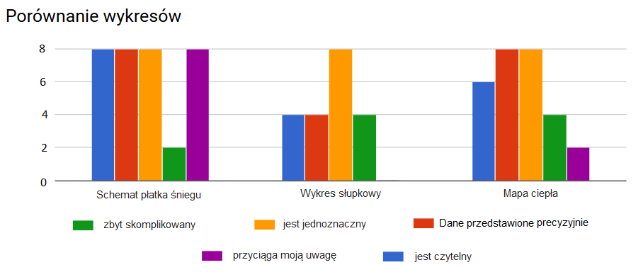
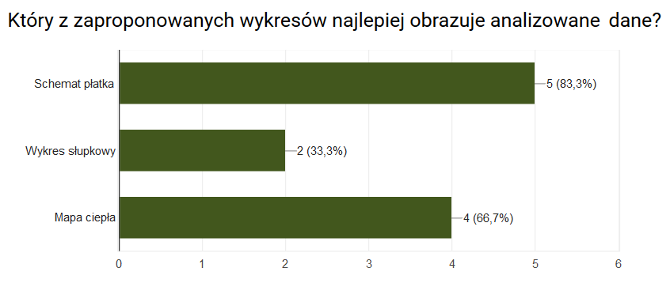

<html><head><meta charset="utf-8"></head>
```{r setup, include=FALSE}
knitr::opts_chunk$set(echo = TRUE)
  options(Encoding="UTF-8")
library(d3radarR)
library(dplyr) 
suppressMessages(library(sqldf))
suppressMessages(library(RSQLite))
library(ggplot2)
library(reshape2)
library(ggthemes)
library(cowplot)f
```

W tym tygodniu celem było porównanie różnych sposobów wizualizacji tych samych danych. Dane zostały pobrane strony [www.kagle.com](https://www.kaggle.com/thec03u5/fifa-18-demo-player-dataset) i przedstawiają statystyki oraz oceny graczy twórców *FIFA 2018*. Dane zawierają informacje o $17 000$ piłkarzach z całego świata oraz ponad $600$ klubów. Każdy piłkarz został oceniony przez *EA Sports* w każdej z 70 możliwych kategorii. 

W tym raporcie skupimy się wyłącznie na niektórych z ocenionych cech dla wybranych klubów oraz zawodników. Za umiejętności, według których będziemy porównywać kluby oraz graczy, zostały wybrane:

* Overall (całkowita ocena umiejętności)
* Acceleration
* Ball control
* Balance
* Dribling
* Shot power
* Jumping
* Free kick accuracy
* Strength
* Sprint speed

##Schemat płatka śniegu

```{r echo=FALSE, warning=FALSE}
 dane <- read.csv("CompleteDataset.csv", header=TRUE, sep=",", encoding = "UTF-8")

colnames <- c("Name", "Overall", "Acceleration", "Ball control", "Balance", "Dribbling", "Shot power", "Jumping", "Free kick accuracy")
colsToTransform <- c("Acceleration", "Aggression", "Agility", "Balance", "Ball.control", "Composure", "Crossing", "Curve", "Dribbling", "Finishing", "Free.kick.accuracy",
                     "GK.diving", "GK.handling", "GK.kicking", "GK.positioning", "GK.reflexes", "Heading.accuracy", "Interceptions", "Jumping", "Long.passing", "Long.shots",
                     "Marking", "Penalties", "Positioning", "Reactions", "Short.passing", "Shot.power", "Sliding.tackle", "Standing.tackle","Sprint.speed", "Stamina", "Strength", "Vision", "Volleys")

clubs <- c("FC Barcelona", "FC Bayern Munich", "Legia Warszawa", "Chelsea", 'CSKA Moscow')
colnames <- c("Name", "Overall", "Acceleration", "Ball control", "Balance", "Dribbling", "Shot power", "Jumping", "Free kick accuracy", "Strength", "Sprint speed")
origColnames <- c("Name", "Overall", "Acceleration", "Ball.control", "Balance", "Dribbling", "Shot.power", "Jumping", "Free.kick.accuracy", "Strength", "Sprint.speed")

for(i in 1:length(colsToTransform)){
  dane[,colsToTransform[i]] <-as.numeric(substr(dane[,colsToTransform[i]],1,3))
}

meanGrouped <- as.data.frame(dane %>% 
                               group_by(Club) %>% 
                               summarise(overall = mean(Overall)/100,
                                         accelaration = mean(Acceleration, na.rm = TRUE) / 100,
                                         ballcontrol = mean(Ball.control, na.rm = TRUE) /100,
                                         balance = mean(Balance, na.rm=TRUE) / 100,
                                         dribbling = mean(Dribbling, na.rm=TRUE) / 100,
                                         shotpower = mean(Shot.power, na.rm=TRUE) / 100,
                                         jumping = mean(Jumping, na.rm=TRUE) / 100,
                                         freekickaccuracy = mean(Free.kick.accuracy, na.rm=TRUE)/100,
                                         strength = mean(Strength, na.rm=TRUE) / 100,
                                         sprintspeed = mean(Sprint.speed, na.rm=TRUE) / 100) %>% 
                               filter(Club %in% clubs) %>%
                               arrange(Club))

colnames(meanGrouped) <- colnames

pom <- function(values){
  valuesList <- list(0);
  for(i in 1:length(values)){
    valuesList[[i+1]] <- list(axis=names(values[i]), value=values[[i]])
  }
  valuesList[[1]] <- NULL
  return(valuesList)
} 

result <- apply(meanGrouped, 1, FUN = function(row) {
  list(key=row[[1]], values=pom(row[-1]))
})

radar1 <- d3radar(result)
radar1


leadersGrouped <-  sqldf('select * from dane 
                          where ID in 
                         (select ID from dane
                         group by Club
                         order by max(Overall) DESC)
                         and Club in ("FC Barcelona", "FC Bayern Munich", "Legia Warszawa", "Chelsea", "CSKA Moscow")
                         ') %>%
                  arrange(Club) %>%
                  select(origColnames)
                  

colnames(leadersGrouped) <-colnames

for(i in 2:ncol(leadersGrouped)){
  leadersGrouped[,i] <- leadersGrouped[,i] / 100
}


result2 <- apply(leadersGrouped, 1, FUN = function(row) {
  list(key=row[[1]], values=pom(row[-1]))
})
radar2 <- d3radar(result2)
radar2

```

##Wykres słupkowy

```{r echo=FALSE, warning=FALSE, fig.width=10}
meanGrouped2<- meanGrouped
for(i in 2:ncol(meanGrouped2)){
  meanGrouped2[,i] <- meanGrouped2[,i] * 100
}
meanGrouped2 <- melt(meanGrouped2, id.vars = "Name")
meanGrouped2$variable <- factor(meanGrouped2$variable)
meanGrouped2$Name <- factor(meanGrouped2$Name, levels=meanGrouped$Name[order(meanGrouped$Overall)])

ggplot(meanGrouped2, aes(x = variable, y = value, fill = Name)) + 
  geom_bar(stat = "identity", position = position_dodge(), colour="black") +
  scale_fill_brewer(palette="Blues") +
  xlab("") + 
  ylab("") + 
  theme_fivethirtyeight()+ 
  theme(axis.text.x = element_text(angle=35, hjust=0.4, vjust=0.5)) + 
  labs(fill="") +
  ggtitle("Statystyki wybranych klubów")

```

##Mapa ciepła

```{r echo=FALSE, warning=FALSE, fig.width=10}
leadersOverall <- leadersGrouped[,c("Name", "Overall")]
leadersOverall$Name <-  factor(leadersOverall$Name, levels=leadersOverall$Name[order(leadersOverall$Overall)])


leadersGrouped2 <- leadersGrouped
for(i in 2:ncol(leadersGrouped2)){
  leadersGrouped2[,i] <- leadersGrouped2[,i] * 100
}
leadersGrouped2 <- melt(leadersGrouped2, id.vars = "Name")
leadersGrouped2$variable <- factor(leadersGrouped2$variable)
leadersGrouped2$Name <- factor(leadersGrouped2$Name, levels=leadersGrouped$Name[order(leadersGrouped$Overall)])

ggplot(leadersGrouped2) +
  geom_tile(aes(x = variable, y = Name, fill = value)) +
  scale_fill_distiller(palette="OrRd",trans="reverse") + 
  geom_text(aes(x=variable, y= Name, label=value))+
  xlab("") +
  ylab("") +
  theme(axis.text.x = element_text(angle=35, hjust=0.4, vjust=0.5)) + 
  labs(fill="") +
  ggtitle("Statystyki najlepszych graczy")
```

##Porównanie technik wizualizacji

W celu porównania przedstawionych powyżej technik wizualizacji danych przeprowadzona została [ankieta]("https://docs.google.com/forms/d/13aNw2xY6NA8cpH8tcc726AH9xUBuQshwn43PNF6JvWo") na temat opinii dotyczących poszczególnych metod. Na poniższym wykresie przedstawione zostały opinie ankietowanych dotyczące poszczególnych typów wykresów:



Zadaniem ankietowanych oprócz oceny atrakcyjności wizualnej było również wskazanie danych, które zostały szczególnie ukazane na wykresach danego rodzaju. Zebrane wyniki pozwoliły na wysnucie następujących wniosków dotyczących wizualnego odbioru wykresów oraz sposobu prezentacji danych:

  * schemat płatka śniegu:
    + atrakcyjny wizualnie
    + przyciągający uwagę
    + prezentacja ogólnych osiągów
    + rozkład poszczególnych umiejętności
    + brak możliwości porównania wyników poszczególnych zawodników/klubów
    
  * wykres słupkowy:
    + mało atrakcyjny wizualnie 
    + zbyt skomplikowany
    + porównanie osiągnieć klubów w danej kategorii
    + trudność w odróżnieniu słupków od sieie
    + zwrócona również została uwaga na błędny dobór kolorów
    
  * mapa ciepła:
    + umiarkowanie atrakcyjny wizualnie
    + możliwość odczytania dokładnej wartości
    + łatwe porównanie wyników pomiędzy klubami

Jako największe przeszkody w szybkiej analizie danych wskazane zostały:

  * na mapie ciepła zauważane są wyłącznie kolorowe prostokąty, nie można skupić się na danych
  * na wykresie słupkowym trudne jest odczytanie konkretnych wartości, wyznaczenie ogólnej oceny dla konkretnego klubu 
  * zbyt duża złożoność wykesów
  * brak lub niewystarczająca legenda
  * niezbyt czytelne położenie podpisów osi x na wykresie słupkowym



Na podstawie przedstawionych wyników ankiety należy zauważyć, że nie można w sposób jednoznaczy określić najlepszego rodzaju wykresu. Wybór odpowiedniej techniki wizualizacji danych jest silnie uzależniony od informacji, które mają zostać na nim przedstawione. Należy jednak podkreślić, że kluczowa dla ankietowanych była zarówno czytelność i atrakcyjność wizualna wykresów jak i szybkość obserwacji danych.
