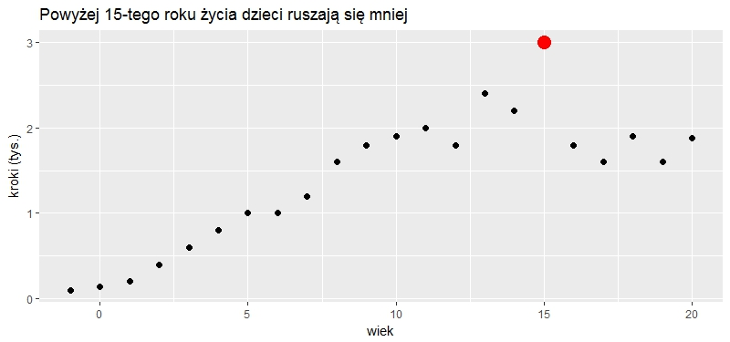
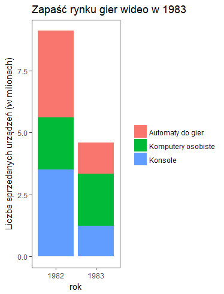
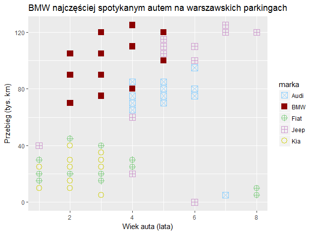
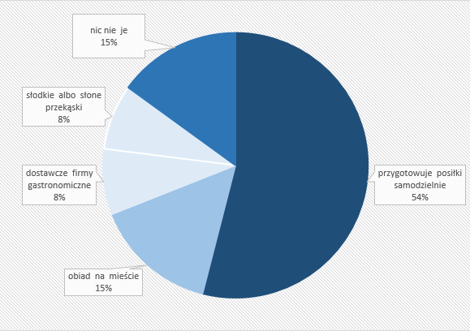

```{r setup, include=FALSE}
knitr::opts_chunk$set(echo = FALSE)
knitr::opts_chunk$set(warning = FALSE)
knitr::opts_chunk$set(message = FALSE)
```

```{r}
library(openxlsx)
library(ggplot2)
```

```{r}
wyniki <- read.xlsx("Techniki Wizualizacji (Odpowiedzi).xlsx")
#usuwam polskie znaki z nazw kolumn i kilka nazw, bo ggplot sobie nie radzi
colnames(wyniki) <- iconv(colnames(wyniki), from="utf-8", to="ASCII//TRANSLIT")
colnames(wyniki)[2] <- "wyk1.co"
colnames(wyniki)[3] <- "wyk1.wiek"
colnames(wyniki)[4] <- "wyk2.co"
colnames(wyniki)[5] <- "wyk2.jak"
colnames(wyniki)[6] <- "wyk3.marka"
colnames(wyniki)[7] <- "wyk3.zero"
colnames(wyniki)[8] <- "wyk3.park"
colnames(wyniki)[9] <- "wyk4.zdanie"
colnames(wyniki)[10] <- "wyk4.rowno"
liczba <- nrow(wyniki)
```


Na potrzeby badania przygotowałyśmy [ankietę](https://goo.gl/forms/ZXBsf647r7jKslAh1) składającą się z 4 wykresów. Proponujemy wypełnić ją przed przeczytaniem raportu, aby później móc porównać własne odpowiedzi z odpowiedziami innych osób.

# Wstęp

Niniejsza praca zawiera badanie dotyczące percepcji danych przedstawianych na wykresach. Celem było sprawdzenie, jak poprzez wykorzystanie powszechnie znanych iluzji wzrokowych można manipulować postrzeganiem danych na wykresie.

Analiza wyników pokazuje, że ludzie niezbyt dokładnie i wnikliwie oglądają wykresy, patrząc jedynie na najbardziej wyszczególnione jego elementy, takie jak kolor czy wielkość. Powoduje to, że dużo łatwiej ulegają złudzeniom optycznym.

Przygotowałyśmy cztery wykresy - każdy nastawiony na odczytywanie innych charakterystyk, takich jak: długości odcinków o różnych punktach zaczepienia, miary kątów, natężenie kolorów, liczności punktów. Część wykresów zawierała dodatkowo "pułapkę", czyli informację, od której chciałyśmy odwrócić uwagę obserwatora. Miało to na celu sprawdzenie, jak dokładnie i wnikliwie ludzie oglądają dane przedstawione na wykresach.

Wykresy wygenerowałyśmy na potrzeby badania, nie są one oparte o rzeczywiste dane.

Ankietę wypełniło `r liczba` osób w różnym wieku, ale cztery osoby go nie podały, więc nie zostały uwzględnione na poniższym wykresie.

```{r}
ggplot(data=wyniki, aes(x=Wiek,fill=Plec)) +
  geom_bar(data=subset(wyniki,Plec == "Kobieta")) +
  geom_bar(data=subset(wyniki,Plec == "Mężczyzna"),aes(y=..count..*(-1))) +
  scale_y_continuous(breaks=seq(-40,40,10),labels=abs(seq(-40,40,10))) +
  xlab("Wiek") +
  ylab("") +
  ggtitle("Struktura płci i wieku") +
  coord_flip() +
  theme_bw()
```


# Wykres 1 - Odwracanie uwagi

Dane dotyczą średniej liczby kroków, które robią dzieci w zależności od wieku. Naszym celem było odwrócenie uwagi obserwatora od błędnych danych - na wykresie obserwujemy dzieci w przedziale wiekowym $[-1,1]$.



Uzyskałyśmy to za pomocą wyszczególnienia wartości największej kolorem czerwonym.

```{r, fig.height=2.5, fig.width= 12}
rysuj <- function(dane, title, legend.row = 1){
tmp <- as.data.frame(round(table(dane)/length(dane) * 100,0))
tmp$cum <- cumsum(tmp$Freq)
colnames(tmp)[1] <- "Var1"


  ggplot(tmp, aes(x=1, y= -Freq, fill = Var1)) +
  geom_col(width = 0.4)+
  geom_text(aes(y = cum-100 - (Freq/2), label = paste0(Freq,"%")), size=4) +
    ggtitle(title) +
    theme_bw() +
    theme(legend.position = "bottom",
          axis.text.x=element_blank(),
          axis.text.y=element_blank(),
          axis.title.x=element_blank(),
          axis.title.y=element_blank(),
          panel.border = element_blank(),
    panel.background = element_blank(),
    panel.grid.major = element_blank(),
    panel.grid.minor = element_blank(),
    axis.ticks.x=element_blank(),
    axis.ticks.y=element_blank(),
    legend.title = element_blank())+
    guides(fill = guide_legend(nrow = legend.row)) +
    scale_fill_manual(values = c("#8dd3c7", "#ffffb3", "#bebada", "#fb8072", "#80b1d3", "#fdb462"))+
    coord_flip()
    
}

rysuj(wyniki$wyk1.co, "Co zauważyłeś/-aś najpierw?")


```

Jak widać powyżej, 63% osób w pierwszej kolejności zauważyło czerwony punkt na wykresie. Nie jest to zaskakujące, ponieważ wyszczególnienie obserwacji ostrym kolorem od razu przyciąga naszą uwagę. Na drugim miejscu plasuje się tytuł wykresu. Zależność przedstawioną na wykresie, czyli rzecz potencjalnie najważniejszą w całej wizualizacji,  zauważył co dziesiąty obserwator.

```{r, fig.height=2.5, fig.width= 12}
rysuj(wyniki$wyk1.wiek, "Czy zauważyłeś/-aś, że obserwacje na początku są błędne - ujemny wiek?")
```

Tutaj wyniki również nie zaskakują. Odwrócenie uwagi obserwatora przy pomocy ostrego koloru skutkowało tym, że ponad 75% ankietowanych nie zauważyło bezsensownych i z oczywistych powodów nieprawidłowych danych.

# Wykres 2 - Iluzje optyczne

Wykres zainspirowany został [Iluzją Titchenera](https://pl.wikipedia.org/wiki/Z%C5%82udzenie_Ebbinghausa), w której dwa koła o tym samym polu, sprawiają wrażenie różnej wielkości, w zależności od tego, jakimi innymi kołami zostały otoczone.

Postanowiłyśmy sprawdzić, czy podobny efekt uda się uzyskać na wykresie słupkowym.



Liczby sprzedanych egzemplarzy komputerów osobistych (kolor zielony) w latach 1982 i 1983 są sobie równe. Jednak w roku 1982 liczby sprzedanych konsol i automatów były zdecydowanie większe niż w 1983 roku.
Pytanie o ocenę zmiany sprzedaży komputerów osobistych miało zbadać, czy udało się uzyskać iluzję optyczną.


```{r, fig.height=2.5, fig.width= 12}
rysuj(wyniki$wyk2.jak, "Jak oceniasz zmianę sprzedaży komputerów osobistych do gier? (zielony kolor)")
```

Tworząc wykres spodziewałyśmy się, że większość ludzi ulegnie złudzeniu i zaznaczy, że sprzedaż komputerów wzrosła. Zaskakujące jest to, że wyniki rozłożyły się dosyć równomiernie. Około 27% pytanych zaznaczyło, zgodnie z danymi, że sprzedaż się nie zmieniła. Około 29% pytanych uległo złudzeniu i zaznaczyło, że sprzedaż wzrosła. Dodatkowo aż 18% osób uznało, iż sprzedaż spadła.

```{r, fig.height=2.5, fig.width= 12}
rysuj(wyniki$wyk2.co, "Co zauważyłeś/-aś najpierw?")
```

Drugie pytanie miało na celu sprawdzenie, co w pierwszej kolejności przykuwa wzrok czytelnika. W równym stopniu zwracano uwagę na tytuł oraz spadek sprzedaży ogółem, czyli największe elementy. Szczegóły (spadek sprzedaży automatów) rzadko były pierwszą rzeczą, na którą ankietowani zwrócili uwagę.


# Wykres 3 - Skupianie uwagi

Dane na kolejnym wykresie przedstawiały przebieg samochodu w tys. km. w zależności od jego wieku. Naszym celem w tym przypadku, było skupienie uwagi odbiorcy na samochodach jednej marki, poprzez wyróżnienie go intensywnym kolorem i wypełnieniem. Efekt ten został wzmocniony również poprzez umieszczenie nazwy marki w tytule wykresu.



```{r, fig.height=2.5, fig.width= 12}
rysuj(wyniki$wyk3.marka, "Jakiej marki samochodów było najwięcej na wykresie?")
```

Zgodnie z oczekiwaniami, ponad 60% ankietowanych stwierdziło, iż najwięcej samochodów było właśnie marki BMW, podczas gdy wszystkich marek, za wyjątkiem Kii było tyle samo. Co piąty ankietowany sądził, iż samochodów jest tyle samo dla każdej marki.

```{r, fig.height=2.5, fig.width= 12}
rysuj(wyniki$wyk3.zero, "Samochód której marki miał zerowy przebieg?")
```

Ponieważ samochody marki BMW były najwyraźniej zaznaczone, wzrok obserwatorów kierował się właśnie na ten obszar wykresu, gdzie znajdowały się te dane. Jedynie 29% stwierdziło, poprawnie, że to Jeep ma zerowy przebieg. Jednak, co ciekawe, 38% w ogóle nie zauważyło takiego samochodu.

```{r, fig.height=2.5, fig.width= 12}
rysuj(wyniki$wyk3.park, "Dane przedstawione na wykresie były zebrane z parkingów w:")
```
Znaczna większość ankietowanych poprawnie wskazała miasto, w którym znajdował się badany parking, co pokazuje, iż tytuł jest elementem, na który zwracano uwagę przy oglądaniu wykresu. Choć nadal dość duża grupa (33%) pominęła go w swoich obserwacjach.

# Wykres 4 - Dezorientujące kąty i kolory

Czwarty wykres przedstawia dane dotyczące sposobu spożywania posiłków przez Polaków w pracy. Na wykresie znalazły się dwie pary grup równolicznych, ale tylko jedna para zaznaczona była tym samym kolorem.



Mamy  zatem do czynienia z dwoma charakterystykami: wielkości kątów i nachylenia (przy ocenie tempa wzrostu w wykresach liniowych) i  barwą koloru.
 
Na wykresie wysyłają one sprzeczne sygnały do odbiorcy. Jedna para, która w rzeczywistości jest równoliczna, została zaznaczona dwoma kolorami o innym natężeniu, co mogłoby sugerować, iż pomimo tych samych kątów oraz liczb na wykresie, ta para nie jest jednak równoliczna (osoby jedzące w pracy vs. osoby jedzące na mieście).
Oczywistym jest to, że uważny obserwator dostrzeże liczby i nie da się zmylić rozróżnieniu kolorystycznemu, jednak wyniki wskazują na to że ponad 30% ankietowanych dało się zmylić.

67% zauważyło, że para zaznaczona oddzielnymi kolorami jest równoliczna. Pozostali stwierdzili, że pomiędzy grupami zaznaczonymi różnymi kolorami istnieje pewne uszeregowanie, jednak nie byli wstanie określić w którą strone (16% odpowiedziało że” Osób nic nie jedzących w pracy jest MNIEJ niż jedzących na mieście” 17% podało odwrotną kolejność).

```{r, fig.height=3, fig.width= 12}
rysuj(wyniki$wyk4.zdanie, "Które z poniższych zdań jest poprawne?", legend.row = 3)
```

Kolejne pytanie stanowi tylko potwierdzenie otrzymanych rezultatów (około 23% stwierdziło, że na wykresie jest mniej niż dwie pary grup równolicznych).

```{r, fig.height=2.5, fig.width= 12}
rysuj(wyniki$wyk4.rowno, "Ile grup równolicznych znalazło się na wykresie")
```

# Podsumowanie

Jak pokazały powyższe wykresy oraz liczby, nie przyglądamy się wykresom zbyt dokładnie. We wszystkich przypadkach, ankietowani dali się złapać w zastawione przez nas “pułapki”.
Możemy więc wyciągnąć wnioski na przyszłość:

* jako twórcy wykresów musimy liczyć się z tym, że większość odbiorców zauważy jedynie to, co jest widoczne na pierwszy rzut oka. Niewiele osób poświęci czas, by przyjrzeć się szczegółom.

* jako odbiorcy musimy uważać na zbyt pobieżne przeglądanie wykresów. Ludzka percepcja często funkcjonuje w sposób, który sprawia, że łatwo możemy zostać wprowadzeni w błąd.
