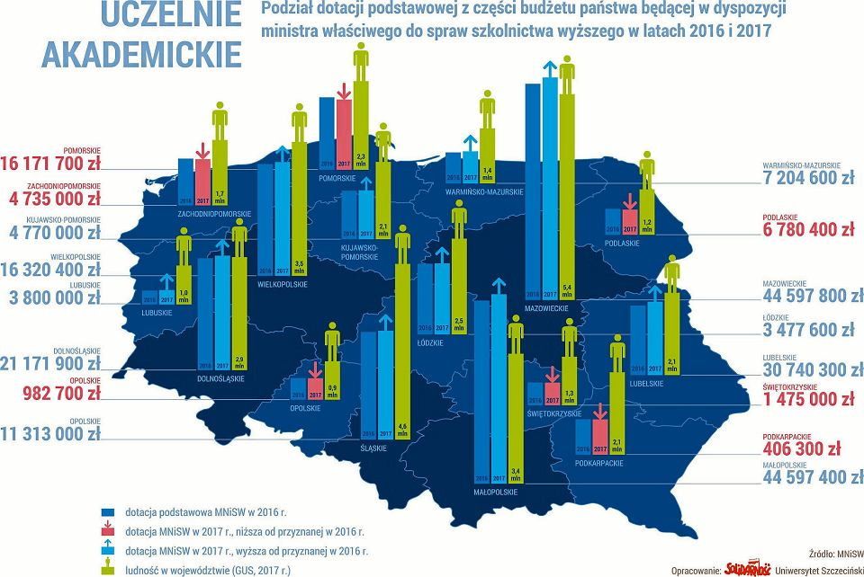

```{r setup, echo=FALSE}
knitr::opts_chunk$set(echo = FALSE)
knitr::opts_chunk$set(warning = FALSE)
knitr::opts_chunk$set(message = FALSE)
```

```{r}
library(ggplot2)
library(scales)

load("dane.rda")
```

#Artykuł

W tym tygodniu w pracy domowej chciałabym skupić się na wizualizacji z artykułu zatytułowanego [Szczecińskie uczelnie tracą na reformie Gowina. Mam pomysł, jak to zmienić](http://szczecin.wyborcza.pl/szczecin/7,150424,22626191,szczecinskie-uczelnie-traca-na-reformie-gowina-mam-pomysl.html).



Grafika zawiera dużo danych, jednak sporej części z nich nie da się odczytać.

* Trudno jest porównać między sobą słupki odpowiadające dotacjom różnych województw, gdyż mają one różne punkty zaczepienia. 

* Każde województwo ma 3 słupki, ale nie jesteśmy w stanie zbyt wiele z nich wyczytać, gdyż na wykresie nie ma osi. W dodatku obok słupków z wysokością dotacji znajduje się słupek odpowiadający ludności danego województwa, który miałby inną skalę osi.

* Nie jest jasne, co oznaczają kolumny z kwotami po bokach mapy. Wartości dotacji w 2017 roku czy moduł różnicy dotacji między latami? Dopiero na podstawie artykułu można wywnioskować, że są to różnice dotacji, kolor oznacza spadek lub wzrost. 


# Moja propozycja wykresu

Wydaje mi się, że na wykresie zaproponowanym przeze mnie łatwiej jest porównać zyski i straty poszczególnych województw oraz odnieść to do ich zaludnienia.

Rzeczywiście, zgodnie z tytułem artyykułu, widać, że województwo zachodniopomorskie jest jednym z tych, które tracą najwięcej. Można również zauważyć, że najbardziej zaludnione województwa zyskują na reformie.

```{r}
ggplot(dane, aes(
                x = as.numeric(factor(ludnosc2, levels = 1:16)), 
                y=roznicaproc, 
                fill = as.factor(sign(roznicaproc))
             )
       ) + 
  geom_col() + 
  theme_classic() +
  scale_fill_manual(values = c("#fdae61","#a6d96a"),guide=FALSE) +
  scale_x_continuous(
    name = "",
    breaks = 1:16,
    labels = dane$woj,
    sec.axis = sec_axis(~., 
      breaks = 1:16,
      labels = dane$ludnosc,
      name = "ludność w województwie [mln]"
    )
   ) +
  scale_y_continuous(
    labels = scales::percent, 
    breaks = seq(from = -0.06, to = 0.06, length.out = 7), 
    limits = c(-0.06,0.06),
    name = "Procentowa zmiana dotacji podstawowej między 2016 a 2017 rokiem"
  )+
  geom_text(aes(label=percent(round(roznicaproc, digits=3))), hjust=-0.5 * (sign(dane$roznicaproc)-1) ) +
  ggtitle("Reforma Gowina - Które województwa zyskują?") +
  coord_flip()

```