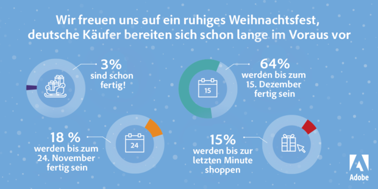

W nadchodzącym tygodniu w Stanach Zjednoczonych sklepy oficjalnie zaczynają promocje przedświąteczne wydarzeniem Black Friday. Ten zwyczaj zawędrował także do Europy, więc wiele artykułów w ostatnich tygodniach dotyczy zakupów przedświątecznych(https://www.marketing-boerse.de/News/details/1745-E-Weihnachtsgeschaeft-waechst-um-20-Prozent/141737). Jeden z nich zawiera taką oto infografikę

<br />
 
 <center>
 
 </center>
 <br />

```{r setup, include=FALSE}
knitr::opts_chunk$set(echo = TRUE)
```


```{r cars,message=FALSE, cache=FALSE,warning=FALSE}
library(ggplot2)
library(ggthemes)

```


Znajdują sie na nim informacje, kiedy Niemcy planyją zrobić zakupy świąteczne w tym; procent osób,które już zrobiły zakupy święteczne(3%), kto zrobi je przed 24 listopada (18%), przed 15 grudnia(64%) i kto zostawi te zakupy na ostatnią chwilę(15%).Informacje zostały zamieszczone na czterech diagramach kołowych co sprawia że ciężko je ze sobą porównać, a podpisy nie wskazują na fragmenty kół, które odpowiadają danej wielkości.
<br />
Zdecydowałam sie ten wykres przedstawić na jednym słupku podpisać wartości procentowe na obszarze odpowiadającym danej wielkości. Jednocześnie dobrałam natężenie kolorów tak, by dane dotyczące osób robiących zakupy najpóźniej były najmocniej nasycone, zaś dane dotyczące osób robiących zakupy z największym wyprzedzeniem były najmniej nasycone.


```{r pressure, cache=FALSE, message=FALSE, out.width='120%'}
dane<-read.csv2("C:\\Users\\Majka\\Desktop\\zakupy.csv", h=F)
library(ggplot2)
vv2<-c(0.03,0.15,0.18,0.64)
dane$V2<-vv2
dane$V3<-"termin zakupów"
ggplot(dane, aes(x=V3, y=V2,fill=V1)) + 
  geom_bar(stat="identity",colour="black")+
  scale_fill_manual(values = c("#D40000","#D43535", "#D47474", "#D4A9A9"))+
  geom_text(aes(label =scales::percent(dane$V2), y=V2),fontface='bold',size=3, position = position_stack(vjust = 0.5))+
 theme_void()+
  ggtitle("Jak wcześnie Niemcy robią zakupy świąteczne?")+
  guides(fill=guide_legend("Kiedy kupią prezenty"))

```


