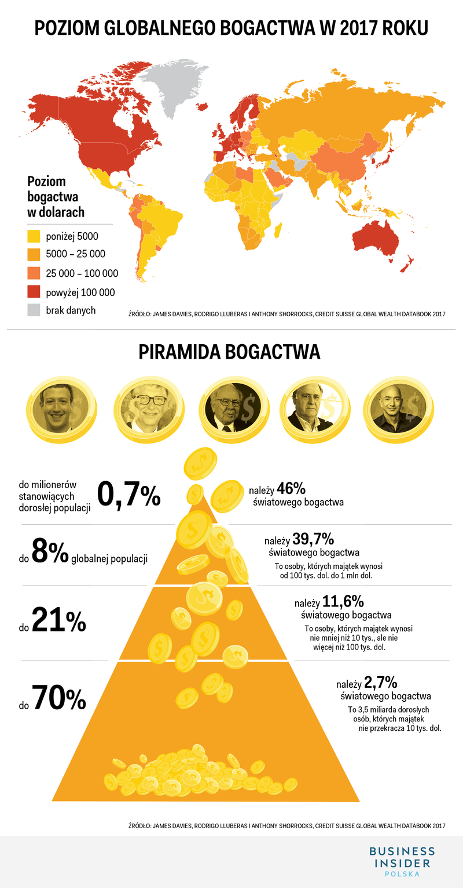

Dane pochodzą z artykułu https://businessinsider.com.pl/finanse/najbogatsi-ludzie-swiata-ile-maja-pieniedzy/v7hrc9r i dotyczą światowego bogactwa. Zostały one zaprezentowane w sposób graficzny, jednak piramida prawdopodobnie pełni jedynie rolę dekoracji.



```{r setup, include=FALSE}
library(ggplot2)
library(ggmosaic)
data <- data.frame(f = c(0.7, 8, 21, 70.3),
                   w = c(46, 39.7, 11.6, 2.7),
                   g = factor(c(1, 2, 3, 4)))
```

Postanowiłem umieścić dane na wykresie słupkowym, gdzie szerokość słupka odpowiada liczności grupy a wysokość - całkowitemu jej udziałowi w światowym bogactwie. Ponadto słupki są pokolorowane na różne kolory w celu zamieszczenia informacji o zakresie majątku osób w grupie.
```{r}
ggplot(data, aes(width=f, x=cumsum(f)-f/2, y=w, fill=g)) +
  geom_col(position="identity") +
  scale_fill_grey(labels=c(">1M $", "100k-1M $", "10k-100k $", "<10k $"), name="Majątek osoby") +
  labs(aes(x="% globalnej populacji", y="% światowego bogactwa")) +
  ggtitle("Piramida światowego bogactwa 2017")+
  theme_bw()
```