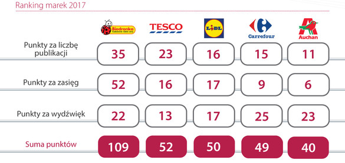
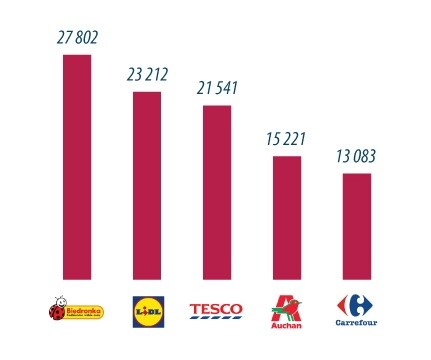
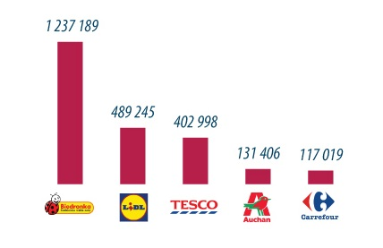

```{r setup, include=FALSE}
knitr::opts_chunk$set(echo = FALSE)
knitr::opts_chunk$set(include = FALSE)
```

```{r}
library(ggplot2)
library(reshape)
```

# Dane
Dane pochodzą z artykułu ze strony bankier.pl ([link](https://www.bankier.pl/wiadomosc/Biedronka-topowa-marka-spozywcza-4032476.html)). Artykuł pojawił się 13.11.17.

Dotyczą one analizy obecności największych marek sklepów spożywczych w mediach.

# Wizualizacje historii

## Obecność w prasie

Na początku przeprowadzona jest analiza (przyznanie punktów za poszczególne elementy) tego jak marki są przedstawiane w prasie.

### Oryginalne przestawienie danych

W artykule sposobem przedstawienia danych jest tabela. O ile kilka wartości można jeszcze przestawić w taki sposób, tak tu, granica została już lekko przekroczona (choć jeszcze nie drastycznie, można tej tabelki użyć jak przykład na granicy, ale już po tej złej stronie). Z samych liczb nie od razu widać zależności.



```{r}
data.points <- data.frame(shop = c("Biedronka", "Tesco", "Lidl", "Carrefour", "Auchan"), number = c(35,23,16,15,11), range = c(52, 16, 17, 9, 6), sentiment = c(22, 13, 17, 25, 23) )
colnames(data.points) <- c("Sklep", "Za liczbę publikacji", "Za zasięg", "Za wydźwięk")

data.points.melt <- melt(data.points, id.vars=c("Sklep"), measure.vars=c("Za liczbę publikacji", "Za zasięg", "Za wydźwięk"))
```

### Zmodyfikowana wersja

Natomiast do przedstawienia tych danych idealnie nadaje się "stertowy" wykres słupkowy.
Pokazuje zależności pomiędzy sklepami na ogólnym poziomie, a tak na poziomie grup przyznawanych punktów.

```{r}
g <- ggplot(data.points.melt, aes(x=reorder(Sklep, -value), y=value, fill=variable)) +
         theme_bw() +
         geom_bar(position="stack", stat="identity") +
        labs(title = "Top 5 sieci handlowych w prasie", x = "Sklep", y = "Punkty", fill = "Typ punktów")
```

```{r include=TRUE}
g
```

## Obecność w internecie/mediach społecznościowych

### Oryginalne przestawienie danych

Kolejnym punktem artykułu jest analiza tego, jak często marki pojawiają się w internecie i mediach społecznościowych.






### Zmodyfikowana wersja


W przedstawieniu danych można niskim kosztem scalić dwa wykresy w jeden i dzięki temu wyraźnie zaznaczyć fakt, że dużo częściej o tych markach mówi się w mediach społecznościowych.

Wykresy wydają się być dużo mniej dokładne, jednak gdyby z oryginalnych wykresów usunąć etykiety zawierające liczność (sama ich obecność świadczy o tym, że coś w tych wykresach jest nie tak) to nie sprawiały by one wrażenia tak czytelnych. Nie dało by się z nich nic odczytać, ponieważ w oryginałach nie ma nawet osi.

```{r}
data.internet <- data.frame(shop = c("Biedronka", "Tesco", "Lidl", "Carrefour", "Auchan"), internet = c(27802,23212,21541,15221,13083)/1000, social = c(1237189,489245, 402998, 131406, 117019)/1000)
colnames(data.internet) <- c("Sklep", "Internet", "Media społecznościowe")

data.internet.melt <- melt(data.internet, id.vars=c("Sklep"), measure.vars=c("Internet", "Media społecznościowe"))

```

```{r}
g <- ggplot(data.internet.melt, aes(x=reorder(Sklep, value), y=value, fill=variable)) +
         theme_bw() +
         geom_bar(position="dodge", stat="identity") +
        labs(title = "Top 5 sieci handlowych w internecie ", x = "Sklep", y = "Liczba wystąpień (w tysiącach)", fill = "") + coord_flip()
```

```{r include=TRUE, fig.width=12}
g
```

Dzięki takiemu przestawieniu widać jak dużo więcej wpisów nt. sklepów jest mediach społecznościowych (co pewnie ma miejsce również w innych dziedzinach). Szczególnie Biedronka pod tym względem deklasuje rywali (czyżby Świeżaki tak mocno zdominowały inne akcje promocyjne?)
