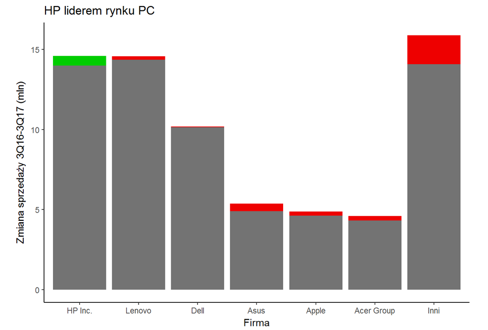

```{r setup, include=FALSE}
library(ggplot2)
library(reshape2)
library(scales)
```

Wybrałem do poprawy pracę Łukasza Ławniczaka, którą przygotował w ramach Pracy Domowej nr 2. Oryginalna wersja jest dostępna pod adresem: https://rawgit.com/pbiecek/TechnikiWizualizacjiDanych2017/master/PraceDomowe/PD_02/LukaszLawniczak/twd02.html. Sam wykres załączam poniżej (png):

```{r echo=FALSE, out.width='100%'}

```

Analizując przedstawiony wykres można znaleźć kilka elementów nadających się do poprawy:

- tytuł nie opisujący wykresu oraz brak podtytułu,
- nieprecyzyjne podpisy osi,
- intensywne kolory zmian, które utrudniają odczytanie wartości dla 2017r. (które wydają się najważniejsze),
- "latające słupki" - wysokość 0 na osi Y nie jest zgodna z dolną linią wykresu

Cytując oryginalną pracę:

> Dane pochodzą z artykułu http://pclab.pl/news75749.html opisującego zmianę sprzedaży na rynku komputerów osobistych w 3. kwartale 2017 roku w porównaniu do roku poprzedniego. Zostały one zebrane przez firmę analityczną Gartner (https://www.gartner.com/newsroom/id/3814066).
> Dane dotyczą sprzedaży komputerów osobistych i laptopów z pominięciem tabletów i Chromebooków.

```{r, echo = FALSE}
df <- read.csv2("twd02data.csv")
df$X3Q17.3Q16Growth[1] <- paste0("+", df$X3Q17.3Q16Growth[1])
df1 <- df[c("Company", "X3Q16Shipments", "X3Q17Shipments")]
df1 <- melt(df1, id.vars = "Company")
df1$Company <- factor(df1$Company, levels=df1$Company[1:7])
df1$value <- df1$value / 1000
```

### Ulepszona wersja


```{r echo=FALSE, fig.align="center"}
g <- ggplot(df1, aes(x=Company, y=value, fill=variable)) +
  geom_bar(stat="identity", position="dodge") +
  labs(title="Sprzedaż komputerów osobistych i laptopów w 3Q 2016 i 3Q 2017",
       subtitle="HP jako jedyny duży producent zwiększa sprzedaż i zostaje liderem rynku PC",
       y="Sprzedaż w milionach sztuk", x="Producent") +
  scale_y_continuous(limits = c(0,17), labels = comma_format(nsmall=1,digits=1)) +
  scale_fill_manual(values=c("#80b1d3","#8dd3c7"), 
                       name="Kwartał",
                      # breaks=c("ctrl", "trt1", "trt2"),
                       labels=c("3Q 2016", "3Q 2017")) +
  geom_text(data = df1[1:7,], aes(x=Company, vjust=-1.5, label=paste0(df$X3Q17.3Q16Growth, "%"), colour = factor(c("1", rep("2",6))))) +
  scale_colour_manual(values=c("#66bd63", "#d73027"), guide=FALSE) +
  theme_minimal()
  
#ggplotly(g)
g
```
