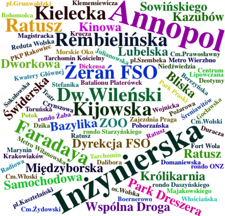
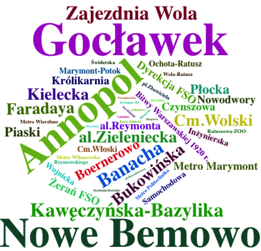
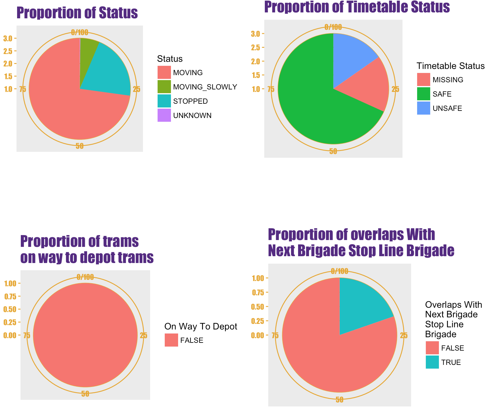

```{r setup, include=FALSE, warning = FALSE}
knitr::opts_chunk$set(echo = TRUE)
source('map.R')

```

Problem 1 : Skręcona kostka

Spacerując po dzielnicach Warszawy skręcasz nogę. Nie chcesz wzywać karetki. Decydujesz dotrzeć do szpitala tramwajem. Doktorzy na mapie oznaczają placówki SOR w stolicy.
```{r,warning=FALSE,message=FALSE,echo=FALSE,fig.width=5, fig.align='center'}
plot_trams_mean_spreed()
```
```{r,echo=FALSE,warning=FALSE , message=FALSE}
source('TWD_Projekt1.R')
source('tramwaje.R')
```
Problem 2: Kto zmoknie ?

Jesień to deszczowa pora roku w Polsce, więc każdy z nas stara się zabezpieczyć przed możliwym zmoknięciem. Jeśli korzystamy z komunikacji miejskiej, warto przyjrzeć się liniom tramwajowym, które z powodu swojego opóźnienia narażą nas na deszcz. Poniższy diagram przedstawia zależność linii tramwajowej od jej opóźnienia w czasie. Dane pobrane zostały z ostatniego dnia. Im kolor kafelka bardziej zbliża się ku czerwieni, tym większe opóźnienie ma tramwaj, co doprowadzi do zmoknięcia oczekujących na niego pasażerów.
```{r rainDrops, echo = FALSE,message=FALSE, warning=FALSE, fig.align='center'}
 drawPlot_rain()
```


Problem 3: Zatłoczone przystanki

Wizualizacja nazw przystanków wskazuje gdzie są największe opóźnienia. Im większa nazwa tym większe opóźnienie, a co za tym idzie? Zatłoczony przystanek! Dzięki tej wiedzy możemy uniknąć jazdy tramwajem niczym sardynka w puszce.

<p>
{height=125px}
</p>

Problem 4: Kierunki kursów

Graficzne przedstawienie kierunku w którym tramwaje kursują ma na celu pokazanie gdzie aktualnie kierowana jest większość ruchu. Moze to pomóc w poszukiwaniach nowego mieszkania - mianowicie dostajemy informację które kierunki są najlepiej skomunikowane, a które gorzej.

<p>
{height=125px}
</p>

Problem 5: Status tramwajów

Poniższe wizaualizacje mogą służyć jako informacja dla kierownika ZTM. W przerwie od kawy może on sprawdzić ogólny status tramwajów, bez zaporzątania sobie głowy zbędnymi szczegółami.

<p>
{height=200px}
</p>

